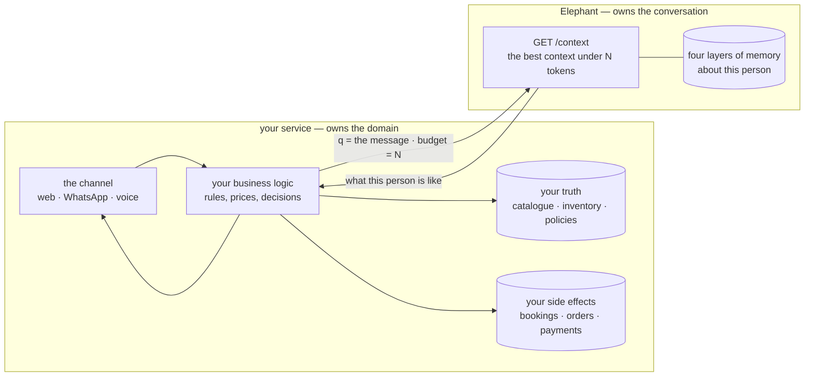
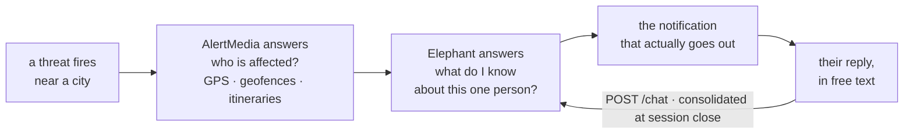
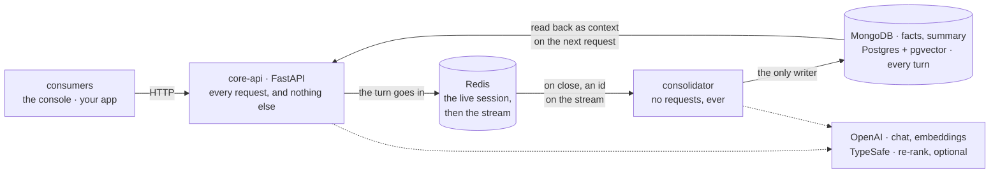
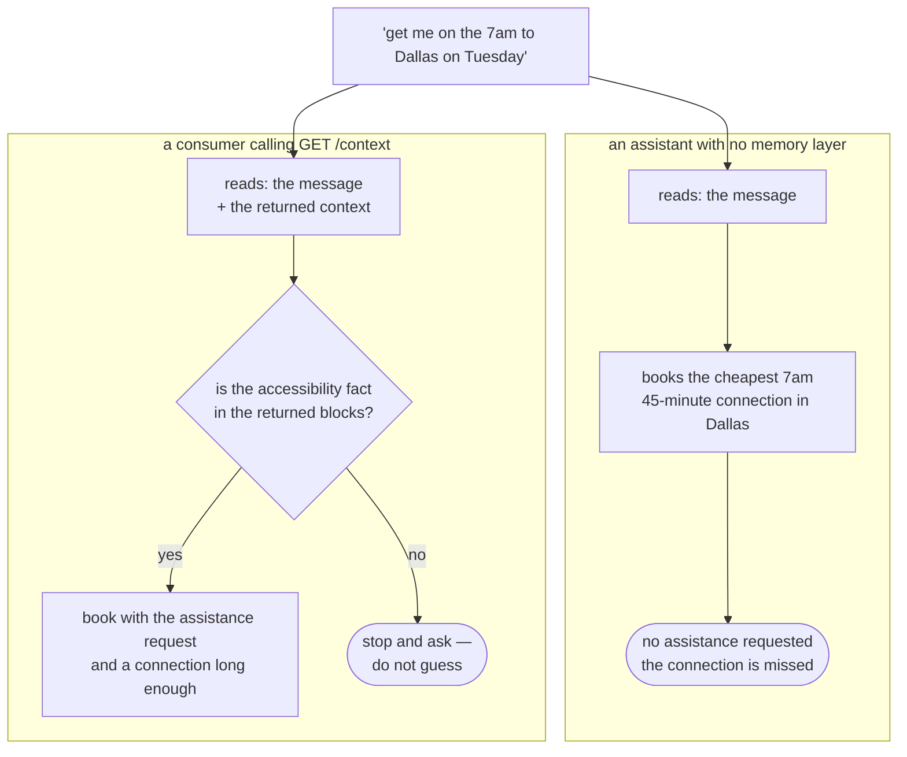

# Elephant — presentation

**12 slides + one live demo · 12:30 against a 10–15 minute slot.**

Everything that goes on a slide is written out below. Nothing points at another file.

- **ON THE SLIDE** — the literal content. Paste this.
- **SAY** — spoken, not on screen. Goes in the speaker notes.
- **IF ASKED** — the answer to the question this slide provokes. Not on the slide.

**The demo runbook is not in this file.** It is in `DEMO-SCRIPT.md` — hold that one open
on a second screen; nothing in it belongs on a slide.

Diagrams are Mermaid. Paste the block into <https://mermaid.live>, export PNG, drop the
image on the slide. The ASCII tables paste straight into a monospace text box.

---

## Running order

| # | Slide | Time |
|---|---|---|
| 1 | Elephant | 0:15 |
| 2 | What this was | 0:40 |
| 3 | One endpoint, one question | 0:45 |
| — | **LIVE DEMO · 5 beats** | 5:00 |
| 4 | What you just saw | 0:45 |
| 5 | The turn that mattered scored lowest | 0:45 |
| 6 | A better model does not fix it | 0:45 |
| 7 | Cosine ranks the topic. A noul ranks the help. | 0:50 |
| 8 | What that costs | 1:15 |
| 9 | What the ceiling buys | 0:50 |
| 10 | Memory is not knowledge | 0:50 |
| 11 | AlertMedia | 1:20 |
| 12 | Where it breaks | 0:45 |
| 13 | What is already moving | 0:45 |

**One excursion to the browser, at minute two.** Out once, back once, never again.

**Total with the five-beat demo: ~13:50.** Cut **slide 6** to get back under 13:00 — it is
first in the cut order anyway and beat 3 makes part of its point live.

**If the slot is 10 minutes**, cut in this order, decided now and not live:
slide 6 → **demo beats 2 and 4** → slide 9 → fold slide 12 into slide 13.
Beats **1, 3 and 5** are the three that carry distinct arguments and run in 2:40 together.

**Never cut:** demo beats 1, 3 and 5 · slide 5 · slide 11. Without the demo there is no
evidence; without slide 5 there is no judgment; without slide 11 there is no reason to
care.

---

# 1 · Elephant

### ON THE SLIDE

> # Elephant
> ### Memory as a service
>
> A brain that only knows how to talk.

### SAY

Fifteen seconds. Name, one line, move. Do not explain the name.

---

# 2 · What this was

### ON THE SLIDE

> **May 2025.** A conversational assistant for a used-car marketplace, built in three days
> as a technical challenge. It already had four kinds of memory, modelled on the brain.
>
> It also had a hardcoded `if/elif` chain that classified every message and routed it:
>
> ```
> IntentionHandler
>   ├── SearchHandler    vector search over the car catalogue
>   ├── FinanceHandler   financing calculations
>   ├── InfoHandler      company information
>   └── ExitHandler      persist the conversation and clear the cache
> ```
>
> **September 2026.** The domain came out. The search, the financing, the company
> information, the intent chain — all of it deleted.
>
> **What was left was the part that was actually interesting.**

### SAY

Forty seconds, and do not linger.

The original design was proudest of the orchestrator — a central brain routing intentions.
I deleted it, because deciding *what to do* with a message is domain knowledge, and domain
knowledge does not belong in a memory engine. That decision is what turned a chatbot for
one company into something any company could use.

What survived is in the code today with the same names: working memory, summary memory,
fact memory, episodic memory. The good idea was there in 2025. It was buried under a car
dealership.

### IF ASKED

*What else changed?* Episodic memory used to retrieve by recency and dump the whole
history. Now it embeds every turn and retrieves by meaning, under a ceiling. That is the
difference between the two arms on slide 9.

---

# 3 · One endpoint, one question

### ON THE SLIDE

> Elephant stores conversations, compresses them, and answers one question on demand:
>
> ### *A message is about to arrive. What should I put in the prompt, without exceeding N tokens?*
>
> ```
> GET /sessions/{id}/context?q=<the message>&budget=2000
> ```
>
> That endpoint is the product.
> It does not know what business it serves.

### SAY

The model is a commodity. What you *hand* the model is not, and that is where the cost and
the quality both live. Remembering is not a storage problem — storage is cheap and solved.
It is a *choosing* problem, and choosing under a budget is what this answers.

I am going to show it before I explain it.

### IF ASKED

*Why not just use a bigger context window?* Because the cost is linear in what you put in
it and the window is finite. Slide 8 has the numbers.

---

# LIVE DEMO — 5:00 · five beats

### ON THE SLIDE

> ### Three conversations already happened.
> ### Watch the right-hand pane — it shows the context *before* the answer.

Nothing else on the slide. Leave it up for the whole demo — it must not compete with the
screen.

### THE RUNBOOK IS A SEPARATE FILE

Everything about running the demo — the setup checklist, the three paste blocks, the five
beats with their verified numbers, what to say at each one, and what to do if something
breaks — is in **`DEMO-SCRIPT.md`**. Hold that one; do not paste it into the deck.

The five beats, for the running order only:

| Beat | Demonstrates | Time |
|---|---|---|
| 1 | it recalls what nobody declared | 1:10 |
| 2 | the fourth slot appears on the second message | 0:40 |
| 3 | the budget slider: recall shrinks, facts survive whole | 0:50 |
| 4 | a different question pulls a different memory | 0:50 |
| 5 | an empty subject returns no blocks at all | 0:40 |

---

# 4 · What you just saw

### ON THE SLIDE

> Memory lives in four layers. They are not four features — they are four answers to the
> same question: **how do I spend fewer tokens without forgetting?**
>
> | Layer | Its answer | Store |
> |---|---|---|
> | **Working** | the last turns go in verbatim — few and cheap | Redis |
> | **Facts** | what endures is extracted and kept small | MongoDB |
> | **Summary** | the middle is compressed into prose | MongoDB |
> | **Episodic** | the rest is archived and **indexed, so only what applies comes back** | Postgres + pgvector |
>
> **The invariant: `used` never exceeds `budget`. Ever.**

### SAY

Three stores because there are three access patterns, not for show. Redis is volatile and
ordered and thrown away. Mongo replaces whole documents. Postgres holds a log that only
grows and has to be searched by meaning — a different job.

The budget is spent by priority — facts, summary, working, recall — and read in a
different order, with recall before the live conversation so the model reads it as
background rather than as what just happened.

### IF ASKED

*Why not one store?* Appendix A2 has the access-pattern table.

---

# 5 · The turn that mattered scored lowest

### ON THE SLIDE

> The design called for a similarity floor: discard retrieved turns below a minimum score,
> so the system does not "remember" something irrelevant just because it was the
> least-bad match.
>
> Measured with real embeddings on a seeded conversation:
>
> ```
> relevant   [0.2634, 0.3664]
> noise      [0.2711, 0.3460]
> ```
>
> **The ranges overlap completely.**
> The best distractor beats two of the four relevant turns.
>
> For *"a dinner for six people — any suggestions?"*, the most useful turn in the
> corpus — ***"I've been vegetarian for about a year"*** — scored **lowest of
> everything**, below all noise.
>
> Meanwhile *"the commute to the office is killing me"* scored near the top, because it
> shares "work" semantics with the question.

### SAY

This is the slide I would keep if I could only keep one.

The fragment you just watched arrive is the fragment that, by the metric everybody uses
for this, looked like the *worst* candidate in the corpus. If I had shipped the floor the
design called for, the demo you just saw would not work.

I did not discover that by reasoning about it. I discovered it by measuring it, and the
measurement killed the feature.

### IF ASKED

*So similarity is useless?* No — it is a compression step. It gets five candidates out of
millions. It just does not rank them.

---

# 6 · A better model does not fix it

### ON THE SLIDE

> Same measurement, different corpus, different language, three embedding models:
>
> ```
> text-embedding-3-small  1536    separation  -0.1639
> text-embedding-3-large  1536    separation  -0.1250
> text-embedding-3-large  3072    separation  -0.1227
> ```
>
> A better model barely moves it. **This is not a resolution problem.**
>
> **Cosine similarity measures what a passage is about, not whether it answers the
> question.**
>
> `RECALL_MIN_SIMILARITY = -1.0` — the floor is off. What bounds the cost is the budget
> ceiling, not a relevance threshold.

### SAY

The obvious next move when a metric underperforms is to buy a better metric. Twice the
dimensions, the larger model — it moves the number by four hundredths and the ranges still
overlap.

That is the moment the problem changes shape. It is not that the signal is noisy. It is
that it is the *wrong signal*, and no amount of resolution fixes a wrong signal.

### IF ASKED

*What is "separation"?* Mean relevant score minus mean noise score. Negative means noise
outranks signal on average.

---

# 7 · Cosine ranks the topic. A noul ranks the help.

### ON THE SLIDE

> So the second pass asks a different question of each candidate:
>
> ### *Would putting this excerpt in front of the assistant change or improve its reply?*
>
> It returns a probability between 0 and 1. Both numbers travel with every fragment, in
> the API response and on screen:
>
> ```
> similarity 0.3466   usefulness 0.77   ← the beef-broth story
> similarity 0.1760   usefulness 0.03   ← the passport distractor
> ```
>
> On a corpus polluted with a stray test session that was a near-paraphrase of the
> question:
>
> ```
> similarity 0.7621   usefulness 0.64   ← the echo of the question
> similarity 0.3384   usefulness 0.88   ← the fact that answers it
> ```
>
> **Only the order changes. Nothing is filtered** — a threshold needs a distribution that
> does not exist yet, and the budget ceiling already decides who gets cut.

### SAY

Cosine ranked the echo of the question highest. The second signal ranked the fact that
answers it highest. That is the whole difference, and it is visible in four numbers.

One more thing about this dependency: it is allowed to fail. With the key unset, or the
service slow past a second and a half, recall keeps its cosine order, every fragment
reports `usefulness: null`, and nothing else changes. Somebody who clones this repository
with nothing but an OpenAI key gets a working system.

### IF ASKED

*Why not filter as well as reorder?* Because I have no measured threshold, and inventing
one would silently lose memory — the one failure this cannot have.

---

# 8 · What that costs

### ON THE SLIDE

> One session, measured end to end on real prompts and real replies:
>
> ```
> input        61.2%
> output       31.8%     ← 32% of the cost, 6% of the tokens
> re-rank       6.1%
> embeddings    0.8%
> ```
>
> Per user, by how much they actually use it:
>
> ```
> profile            | msgs/mo |  $/month |  $/year
> -------------------+---------+----------+---------
> safety companion   |      32 | $ 0.0224 | $  0.27
> daily assistant    |     120 | $ 0.0862 | $  1.03
> support agent      |     308 | $ 0.2093 | $  2.51   ← the baseline
> power user         |     720 | $ 0.4927 | $  5.91
> ```
>
> At 10,000 heavy users: **$2,267 a month, $2.72 per user per year** — 92% of it the API
> bill, 8% the infrastructure. **The crossover is 831 users.**

### SAY

Two things about how this was built, because the number is worthless without them.

First, I made the baseline the *heavy* profile on purpose. Somebody who talks to it every
working day, fourteen turns at a time. A flattering usage assumption produces a flattering
number that collapses the moment somebody asks *how often*.

Second, cost per user is meaningless without a denominator. Below 831 users you are paying
for an idle cluster and the answer to "how do I cut costs" is *get more users*. Above it,
infrastructure is noise and the only lever is tokens per message — which is the lever this
system exposes as a request parameter.

It excludes dev and staging, backups, observability, a support plan, multi-AZ, and every
human being involved, who costs more than all of it combined.

### IF ASKED

*How do you know?* A script in the repo, with every measured input and every list price
named and dated. Change the profile, every table re-derives.

---

# 9 · What the ceiling buys

### ON THE SLIDE

> The same user, with no budget — the whole history in every prompt:
>
> ```
> month | naive in/msg | naive $/mo | layered $/mo
> ------+--------------+------------+-------------
>     1 |       14,578 | $    0.944 | $     0.2093
>     6 |      159,184 | $    9.852 | $     0.2093
>    12 |      332,711 | $   20.541 | $     0.2093
>    24 |      679,765 | $   41.919 | $     0.2093
> ```
>
> **Month 6 is 47×. Month 12 is 98×. Month 24 is 200×, and still climbing.**
>
> But the column that matters is not the money — it is `naive in/msg`. It grows without
> bound, so the naive arm does not merely get expensive: **it eventually stops fitting in
> any context window and simply fails.**

### SAY

The flat column is flat because it was *chosen*. It stays flat for somebody with ten years
of history.

That is the cost/benefit in one line: it converts an unbounded, silently growing cost into
a constant that the caller picks per request — and it proves the constant on every
response.

And the honest part: at month one the difference is under 2×. At demo scale this
architecture saves nothing. If I had run the benchmark on the demo corpus and reported a
saving, I would have been measuring the size of the corpus, not the design.

### IF ASKED

*Is the naive arm real?* Yes — `?naive=true` on the chat endpoint, kept precisely so this
comparison can be re-run rather than quoted.

---

# 10 · Memory is not knowledge

### ON THE SLIDE



> **Memory is what was said. Knowledge is what is true.**
>
> **Whoever owns the side effect owns the loop.**

### SAY

Elephant can tell you this person is vegetarian and was disappointed by a place in Roma
Norte. It does not know which restaurants exist, what they cost, or whether a table is
free on Thursday. That is your database, and it stays yours.

Booking a table changes the world, so the service that can book it drives the conversation
and calls this as one input among several. Elephant never calls out, never decides, never
acts. It answers a question about a person and stops.

Which is why plugging a business into it means writing a service *next to* it, not a
module inside it. No orders, no inventory, no intent classifier in the core.

### IF ASKED

*How is this different from an assistant that stores preferences?* Because the context
comes back **as data** — named blocks with their token costs — before anything is done. A
booking flow can refuse to proceed if the accessibility fact is not in the response. That
is a check a program runs and a test covers. An assistant that keeps memory inside the
model cannot be asked that question. Appendix A8.

---

# 11 · AlertMedia

### ON THE SLIDE



> **AlertMedia answers *who*. Elephant answers *what do I know about them*. Their reply
> closes the loop.**
>
> Four shipped AI capabilities — and all four point the same way:
>
> | Capability | Who it serves | Direction |
> |---|---|---|
> | AI Assistant (Feb 2025) | security and resilience teams | outward |
> | Risk Intelligence / Real-Time Signals | the organization | outward |
> | Social Intelligence | the organization | outward |
> | Analytics (May 2026) | administrators | upward |
>
> **Four systems that look outward. This is the one that looks inward** — not at the
> threat, at the person the threat is about to reach.

### SAY

Everything they hold about a person is structured and describes the present: GPS every
twenty seconds, geofences, itineraries synced from booking systems, check-ins, HRIS
attributes, incident history. All of it current state.

**The bridge is already in the product, and it is currently write-only.** They already
collect free text from employees — two-way replies, session notes, incident reports. Today
that text is read once, by whoever is handling that event, and then it is a row. It is
never asked a question.

Picture an itinerary that puts somebody in a city where a threat just fired. They know
where the person is, which geofence, and how to reach them, and their AI Assistant drafts
an excellent notification in seconds. What no part of that stack knows is that the same
employee wrote, in a check-in reply eleven months ago, that they got badly ill after
eating near their hotel in that district — and mentioned, in a different incident, that
they do not drive at night.

Those two sentences were typed by the employee, into their product, in free text. **They
are already in the building. They just have nowhere to live.**

A threat feed with perfect coverage still sends the same sentence to ten thousand people.
This is what makes the ten-thousandth one feel written for them — at a couple of dollars
per person per year.

### IF ASKED

*Where did this come from?* Public materials only, reviewed September 2026. I am
describing the shape of an integration, not making a claim about anybody's roadmap.

---

# 12 · Where it breaks

### ON THE SLIDE

> A design document without this section is a brochure.
>
> - **Facts and recall can say the same thing twice.** When facts say *vegetarian* and
>   recall returns the turn where he said it, the prompt pays for both. Cross-layer
>   deduplication is real, and not worth its cost at this scope.
> - **Retrieval is single-hop.** *"What did I say about the place my sister recommended?"*
>   needs two memories connected. This retrieves one at a time.
> - **The episodic index is only written at session close.** The live conversation is not
>   retrievable by meaning — working memory covers it, by recency.
> - **Consolidation is nearly-exactly-once.** Only the turn log is idempotent. A retry
>   that dies past the append can state the same thing twice in the summary. Degraded,
>   never corrupted, no turn lost.
> - **Contradictions resolve by an ordering rule**, not a temporal knowledge graph.
>   Strictly worse than what Zep does, and the right trade at this scope.

### SAY

I would rather say these than be asked them. Each one is a decision with a reason, not an
oversight, and the last one names a competitor who does it better.

---

# 13 · What is already moving

### ON THE SLIDE

> **MongoDB comes out.** It is inherited. Documents were the right shape when facts and
> summary were the only long-term memory; pgvector arrived later, for a different layer,
> and nobody revisited the first decision. Two documents per subject, fetched by key and
> written whole, is something Postgres `JSONB` does in a store that is already there.
>
> The line item is the smaller half: it also removes a second connection pool, a second
> failure mode, a second backup policy.
>
> **The database shards cleanly, and that was luck as much as foresight.** No query in
> this product crosses a subject — recall is scoped to one `subject_id`, facts and summary
> are keyed by subject, working memory by session. `subject_id` is a perfect shard key and
> **it was not chosen to be one.**
>
> **The filter that decides what to forget is not built.** The integration point is
> consolidation. What stops it is not the model — it is that discarding a turn is
> irreversible and there is no measured threshold to discard one at.

### SAY

I did not bring a finished product, and that is deliberate. A system I could not criticise
would mean I had stopped looking at it.

Those three are ranked by how soon they matter. The first is work I am doing. The second
is a property I noticed rather than designed, which is worth admitting out loud. The third
is a promise the original design made that I have not kept, and I would rather leave it
unkept than invent a threshold that silently loses somebody's memory.

---

# Appendix — not presented

Open only if asked. One slide each.

### A1 · How it runs



> `core-api` answers requests and writes only the live session. The `consolidator` answers
> nothing and is the only thing that writes long-term memory. Memory is a loop, not a pile.
>
> One deliberate exception: `DELETE /subjects/{id}` erases across all four layers from the
> API, because an erasure request has to be synchronous and confirmable.

### A2 · Three stores, three access patterns

> | Store | Pattern that justifies it |
> |---|---|
> | **Redis** | volatile, ordered, thrown away when the session closes |
> | **MongoDB** | documents replaced whole — `$set`, never appended |
> | **Postgres + pgvector** | a log that grows forever and must be searched by meaning |

### A3 · Spending order is not reading order

> Spent by priority: `facts → summary → working → recall`
> Rendered in reading order: `facts · summary · recall · working · <the message>`
>
> Nothing is truncated mid-sentence — a block goes in whole or stays out. Working memory
> **stops** at the first turn that does not fit, because recency is an order. Recall
> **skips** and keeps going, because relevance is not.

### A4 · Consolidation is the sleep phase

> Closing a session returns `202` and enqueues on a Redis stream. A separate worker
> embeds the turns in one batch, writes them to Postgres, merges the summary, extracts the
> facts, and only then acknowledges.
>
> Same division of labour the brain makes: during sleep, consolidation filters the day's
> experiences. Running it out of process is what lets an API restart and a consolidation
> survive each other. A sweep catches sessions that go quiet without ever being closed.

### A5 · Five defects, five green test suites

> | Defect | What the test verified |
> |---|---|
> | `/search` raised `NameError` on every call | nothing — no test exercised the path |
> | `sanitize_message` was `return message` | a test asserted a `<script>` passes through unchanged |
> | `history()` returned the conversation reversed | the right *number* of turns, not the right order |
> | Facts and summary injected twice per prompt | each layer in isolation, never the assembled prompt |
> | Per-block token counts were not additive | `sum(blocks) == used` — self-consistent and still wrong |
>
> BPE tokenizers merge across boundaries, so `tokens(a) + tokens(b) ≠ tokens(a+b)` unless
> each block ends at a clean break. Without a trailing newline on every block, `used` would
> have quietly understated the real prompt — **the invariant this system sells would have
> been false, with the test passing.**
>
> None were caught by running tests. All five were caught by asking what a piece of code
> actually does.

### A6 · Demo screenshot — the context pane

Capture before the presentation: the four slots, the token costs, the recalled fragment
with its two scores.

### A7 · Demo screenshot — the answer

Capture before the presentation: the reply raising the broth.

### A8 · Why a stored preference is not the same thing



> **The diamond is the differentiator.** The context comes back as data, before anything
> is booked, so a consumer can assert on it.
>
> The failure is not symmetric: forgetting someone likes aisle seats is an annoyance;
> forgetting someone needs an aisle-chair transfer leaves them at a gate.
>
> And the thing that must never be dropped is paid for first — facts are the first layer
> funded and go in whole or not at all, by construction rather than by prompt engineering.

### A9 · The full cost model

> One session of the baseline profile, 14 turns:
>
> ```
> chat            24,427 tokens in   1,736 out
> summary merge    2,367 tokens in     485 out
> fact merge       2,326 tokens in     299 out
> embeddings       4,032 tokens in
> re-rank         13,888 tokens in
> ```
>
> Prompt tokens across a session, which is why long conversations have a predictable price:
>
> ```
> turn      1      2      3      4      5      6
> in    1,103  1,049  1,218  1,427  1,684  1,994
> ```
>
> It climbs while working memory fills, then pins against the ceiling. Every turn after the
> sixth costs the same 1,994.
>
> The cluster, single-AZ, us-east-1 list prices: **$173.96/month.** The NAT gateway is 19%
> of it — $32.85 so a container can reach an API. Putting the tasks in a public subnet
> removes the line.
>
> **The bill is not in the disk, it is in the RAM.** 30,782 bytes per turn measured; at
> 10,000 users for a year that is 1.1 TB, which is $131 a month. But an HNSW index answers
> quickly when it is resident, and 37 million vectors do not fit in a `db.t4g.medium`.
> The instance class is chosen by the index, not by the data.

### A10 · Where this sits

> | | Its position |
> |---|---|
> | **Mem0** | extracts atomic facts; fused semantic + keyword + entity retrieval |
> | **Zep / Graphiti** | bitemporal knowledge graph — *what was true, and when?* |
> | **Letta** | the agent edits its own memory |
> | **Elephant** | **composing context under an explicit token budget** |
>
> Mem0 reports 94.4 on LongMemEval; an independent comparison reports 49 for Mem0 against
> 71.2 for Zep — on the same benchmark. Nobody is lying; the setups differ. Which is the
> point: **a number without its method is marketing**, and that applies to my numbers too.

---

## Open

- [ ] Language — this is drafted in English. Say the word and the speaker notes flip.
- [ ] Is slide 13 the close, or is there an ask after it?
- [x] Subject `demo` seeded clean and verified end to end.
- [ ] A6 and A7: capture only if there is time. The live demo is the primary.
