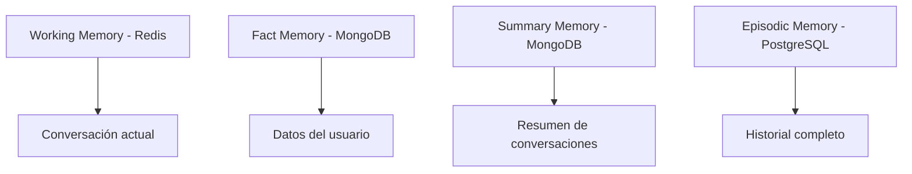

# Elephant

Elephant is a conversational backend with layered memory. It is built with FastAPI,
SQLModel, PostgreSQL with pgvector, MongoDB, Redis, and Docker.

## Features

- Keep active sessions in Redis with a renewable TTL
- Store factual and summary memory in MongoDB
- Store embedded conversation turns in PostgreSQL with pgvector
- Consolidate closed sessions in the background

## Getting Started

### Requirements

- Docker and Docker Compose
- [uv](https://docs.astral.sh/uv/) — `brew install uv`
- Make

`OPENAI_MODEL` defaults to `gpt-5.6-luna`. That line rejects `temperature`, so the
client does not send it and steers output with `OPENAI_REASONING_EFFORT` instead;
blank that variable out for a model that does not accept it, such as `gpt-4o`.

### Running the Project

```bash
cp .env.example .env    # only outside a Superset workspace; setup does it for you
make up
```

`make up` waits for Mongo, Redis and Postgres to report healthy before starting
`core-api`, which creates its own PostgreSQL schema on startup. There is no
separate initialization step.

Schema changes may require a local reset. `docker compose down -v` deletes the
`pg_data` and `mongo_data` volumes. Both volumes are intentionally disposable;
PostgreSQL turn history and MongoDB memory are discarded:

```bash
docker compose down -v --remove-orphans
make up
```

Services listen on the ports in `.env`. Inside a Superset workspace those come
from a reserved block, so several workspaces run side by side:

| Service | Variable | Default |
|---|---|---|
| core-api | `CORE_API_PORT` | 8000 |
| agent | `AGENT_PORT` | 8001 |
| memory | `MEMORY_PORT` | 8002 |
| postgres | `POSTGRES_PORT` | 5432 |
| mongo | `MONGO_PORT` | 27017 |
| redis | `REDIS_PORT` | 6379 |

To start a single service: `docker compose up -d --wait memory`.

> **Orphaned containers from before the compose project name was pinned:** if you
> ran this stack before `docker-compose.yml` started setting `name: elephant-${PORT_BASE:-8000}`,
> your old containers and volumes live under the previous implicit project name (the
> worktree's directory name), and `docker compose down -v` here will not remove them.
> No data is lost, but they linger. List and remove them with:
> `docker compose -p <old-name> down -v`.

### Tests

```bash
make test        # every service
make lint
make typecheck
```

Other available urls:

- `POST /sessions` creates a conversation for a subject.
- `GET /sessions/{session_id}` reports consolidation status and turn count.
- `GET /sessions/{session_id}/context?q=&budget=` returns the best context that
  fits in `budget` tokens, with the token cost of every block. `used` never
  exceeds `budget`; a budget under `MIN_CONTEXT_BUDGET` answers `400`.
- `POST /sessions/{session_id}/chat` answers from memory and returns the context
  it used. `budget` in the body is optional; `?naive=true` runs the control arm,
  which dumps the whole episodic history instead of assembling a budget.
- `POST /sessions/{session_id}/close` schedules consolidation and returns `202`.

Memory inspection, which is what makes the layers visible:

- `GET /subjects/{subject_id}/memory/facts` what the system knows about a subject.
- `GET /subjects/{subject_id}/memory/summary` how it summarizes them.
- `GET /subjects/{subject_id}/recall?q=&k=` fragments retrieved by similarity.
- `GET /sessions/{session_id}/memory/working` the turns still in Redis.
- `GET /sessions/{session_id}/turns?limit=&offset=` the episodic log of a session.
- `DELETE /subjects/{subject_id}` erases a subject from all four layers.

- `GET /author` Retrieve author data


### Useful Makefile Commands

- `make up` - Starts all services in the background
- `make down` - Stops and removes all containers
- `make build` - Builds the service images
- `make rebuild-app` - Rebuilds the `core-api` image and restarts all services
- `make logs` - Follows the logs of all Docker containers
- `make ps` - Lists running containers
- `make shell` - Opens a shell in the `core-api` container
- `make psql` - Opens a `psql` session against the `postgres` container
- `make test` - Runs the test suite for every service
- `make lint` - Checks formatting with black and isort
- `make format` - Applies black and isort formatting
- `make typecheck` - Runs mypy for every service
- `make coverage` - Runs `core-api` tests with coverage

## Conversation Memory Use Cases

Elephant incorporates a multi-layered memory system inspired by human cognition, enabling rich and context-aware interactions. These are the main use cases supported by the `CognitiveOrchestrator`:

### Initial Conversation Bootstrapping
When a user starts a new conversation, the system creates an empty working-memory
session. While handling messages, it reads:
- A summarized memory (semantic context)
- A structured factual memory (preferences, identity, traits)

These components are injected as non-conversational context without storing them in
working memory.

### Ongoing Interaction
As the user and assistant exchange messages, each turn is stored in working memory (Redis). This cache:
- Tracks recent turns for continuity
- Is kept separate from factual memory and summary memory to avoid mixing signal with noise

### Context Under Budget
A caller does not ask for "the memory": it asks for the best context that fits in N
tokens, and the service decides how to build it from the four layers. The budget is
spent by priority — facts, then summary, then working memory, then recall — and read
in a different order, with recall before working memory so the model reads it as
background rather than as what just happened.

Nothing is truncated mid-sentence: a block goes in whole or stays out. `used` never
exceeds `budget`, and every block reports what it cost, so each response proves where
its tokens went.

Facts and recall do not compete. Facts are a summary that may be stale; dated turns
are verbatim and take precedence, which is why fragment dates are visible in the
prompt.

Turns render as `User:` / `Assistant:` under `##` section headers rather than XML
tags: measured on o200k_base, tags cost 9 tokens per turn against 4, which is
7.5% of a 2000-token budget across a 30-turn conversation.

Untrusted text is indented before it is rendered and counted, so nothing inside a
turn sits at column 0 where the prefixes and headers live. A message holding a
line that reads `Assistant: ...` cannot forge a turn, and a multi-line answer
stays visibly part of the turn it belongs to.

### Contextual Expansion on Demand
In naive mode, the orchestrator retrieves the subject's complete episodic history from
PostgreSQL and adds it to the prompt. It has no ceiling, which is the point: it is the
control arm the budgeted path is measured against.

### Conversation Closure and Consolidation
When the session is explicitly closed, the API marks it as consolidating and schedules
background work. The worker:
- Embeds complete user/assistant turns and appends them to PostgreSQL
- Summarizes the recent session and merges it with the prior summary
- Extracts any newly revealed facts and updates the factual memory accordingly
- Clears the turns, marks the session as consolidated, and leaves its TTL running

This layered approach ensures long-term retention, efficient recall, and low-token consumption during active sessions.


## 🧠 Agent Memory


```mermaid
graph TD
  REDIS[Working Memory - Redis] --> CURRENT[Conversación actual]
  MONGO_FACT[Fact Memory - MongoDB] --> USER_DATA[Datos del usuario]
  MONGO_SUM[Summary Memory - MongoDB] --> SUMMARY[Resumen de conversaciones]
  POSTGRES_EPISODIC[Episodic Memory - PostgreSQL] --> HISTORY[Historial completo]
```
