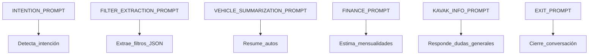
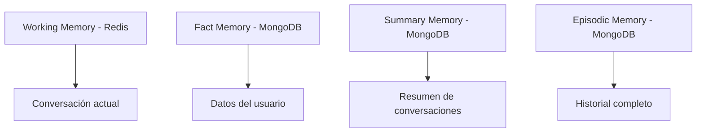

# KABOT

> **OpenSearch status:** References below are inherited documentation. OpenSearch was
> removed in LEO-12, `/search` remains intentionally unresolved pending its replacement
> backend, and the detailed documentation will be updated with that backend.

Kabot is a data ingestion and indexing system that allows uploading CSV files, parsing them, and storing the data both in PostgreSQL and OpenSearch. It is designed with a modular and asynchronous architecture using FastAPI, SQLModel, and Docker.

## Features

- Upload and process CSV files via HTTP endpoint
- Store records in PostgreSQL and OpenSearch simultaneously
- Chunked and asynchronous processing for performance
- Uses OpenSearch to allow indexing and searching
- Uses PostgreSQL for relational data storage

## Getting Started

### Requirements

- Docker and Docker Compose
- [uv](https://docs.astral.sh/uv/) — `brew install uv`
- Make

### Running the Project

```bash
cp .env.example .env    # only outside a Superset workspace; setup does it for you
make up
```

`make up` waits for Mongo, Redis and Postgres to report healthy before starting
`core-api`, which creates its own PostgreSQL schema on startup. There is no
separate initialization step.

Services listen on the ports in `.env`. Inside a Superset workspace those come
from a reserved block, so several workspaces run side by side:

| Service | Variable | Default |
|---|---|---|
| core-api | `CORE_API_PORT` | 8000 |
| agent | `AGENT_PORT` | 8001 |
| memory | `MEMORY_PORT` | 8002 |
| postgres | `POSTGRES_PORT` | 5432 |
| mongo | `MONGO_PORT` | 27017 |
| redis | `REDIS_PORT` | 6379 |

To start a single service: `docker compose up -d --wait memory`.
The ngrok tunnel is opt-in: `make ngrok`.

> **Orphaned containers from before the compose project name was pinned:** if you
> ran this stack before `docker-compose.yml` started setting `name: kabot-${PORT_BASE:-8000}`,
> your old containers and volumes live under the previous implicit project name (the
> worktree's directory name), and `docker compose down -v` here will not remove them.
> No data is lost, but they linger. List and remove them with:
> `docker compose -p <old-name> down -v`.

### Tests

```bash
make test        # every service
make lint
make typecheck
```

You can send a Postman request to `/upload`; this will save data in postgres and create embeddings with data in opensearch.


Other available urls:

- `GET /search` Perform a manual search into OpenSearch.
  Example: `http://localhost:8000/search?query=tracción 4wd`

- `POST /debug/migrate-memory` Enforces system to migrate WorkingMemory to Long-Term  emory. Example: `http://localhost:8000/debug/migrate-memory?user_id=5215578771322`

- `GET /author` Retrieve author data

- `POST /webhook/whatsapp` You can manually simulate the receive of a message, this is a `x-www-form-urlencoded` so it will require fields:
- `From` with format `whatsapp:+5215578771322`
- `Body` with the message
- `Sandbox` By sending `true` you will only see response in Postman but not in whatsapp.


### Useful Makefile Commands

- `make up` - Starts all services in the background
- `make down` - Stops and removes all containers
- `make build` - Builds the service images
- `make rebuild-app` - Rebuilds the `core-api` image and restarts all services
- `make logs` - Follows the logs of all Docker containers
- `make ps` - Lists running containers
- `make shell` - Opens a shell in the `core-api` container
- `make psql` - Opens a `psql` session against the `postgres` container
- `make ngrok` - Starts the opt-in ngrok tunnel
- `make test` - Runs the test suite for every service
- `make lint` - Checks formatting with black and isort
- `make format` - Applies black and isort formatting
- `make typecheck` - Runs mypy for every service
- `make coverage` - Runs `core-api` tests with coverage

### API Endpoint

- `POST /upload` - Upload a CSV file to ingest data into the system

## Notes

- The system uses chunked ingestion (100 records per chunk) to avoid memory issues
- Boolean fields are interpreted from strings like "Sí", "Yes", "True", etc.
- Duplicate records are avoided in OpenSearch by using `stock_id` as the document ID

---

Built with 💻 and lots of coffee ☕️ by Leonardo and ChatGPT.
(Si lo leí, si le di permiso de que lo pusiera ahí, sería irónico crear un sistema para trabajar con LLMs sin usar un LLM ¿no creen? atentamente y con mucho respeto, Leo)


## Conversation Memory Use Cases

Kabot incorporates a multi-layered memory system inspired by human cognition, enabling rich and context-aware interactions. These are the main use cases supported by the `CognitiveOrchestrator`:

### Initial Conversation Bootstrapping
When a user starts a new conversation, the system retrieves and loads:
- A summarized memory (semantic context)
- A structured factual memory (preferences, identity, traits)

These components are injected as non-conversational context to prime the LLM for coherent and personalized responses.

### Ongoing Interaction
As the user and assistant exchange messages, each turn is stored in working memory (Redis). This cache:
- Tracks recent turns for continuity
- Is kept separate from factual memory and summary memory to avoid mixing signal with noise

### Contextual Expansion on Demand
If the LLM cannot resolve a user's query due to insufficient context, the orchestrator:
- Retrieves the full episodic history from long-term memory (MongoDB)
- Augments the current prompt with this deep history for accurate reasoning

### Conversation Closure and Consolidation
When the conversation ends—either due to inactivity or an explicit farewell—the orchestrator:
- Persists the working memory into the episodic memory store (append-only)
- Summarizes the recent session and merges it with the prior summary
- Extracts any newly revealed facts and updates the factual memory accordingly

This layered approach ensures long-term retention, efficient recall, and low-token consumption during active sessions.


## 📚 Used prompts


```mermaid
graph TD
  P1[INTENTION_PROMPT] --> Detecta_intención
  P2[FILTER_EXTRACTION_PROMPT] --> Extrae_filtros_JSON
  P3[VEHICLE_SUMMARIZATION_PROMPT] --> Resume_autos
  P4[FINANCE_PROMPT] --> Estima_mensualidades
  P5[KAVAK_INFO_PROMPT] --> Responde_dudas_generales
  P6[EXIT_PROMPT] --> Cierre_conversación
```

## 🧠 Agent Memory


```mermaid
graph TD
  REDIS[Working Memory - Redis] --> CURRENT[Conversación actual]
  MONGO_FACT[Fact Memory - MongoDB] --> USER_DATA[Datos del usuario]
  MONGO_SUM[Summary Memory - MongoDB] --> SUMMARY[Resumen de conversaciones]
  MONGO_EPISODIC[Episodic Memory - MongoDB] --> HISTORY[Historial completo]
```
