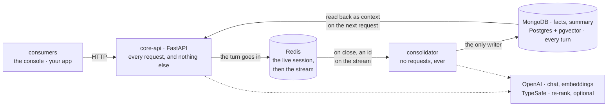
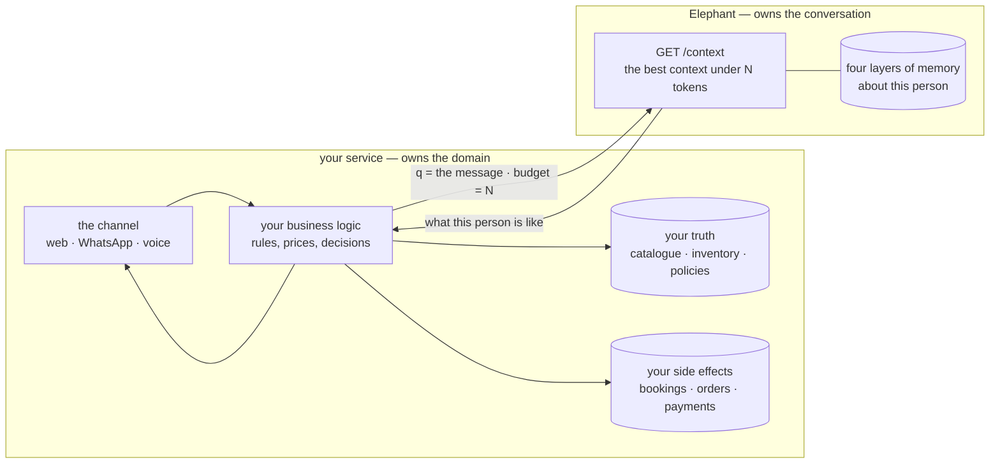
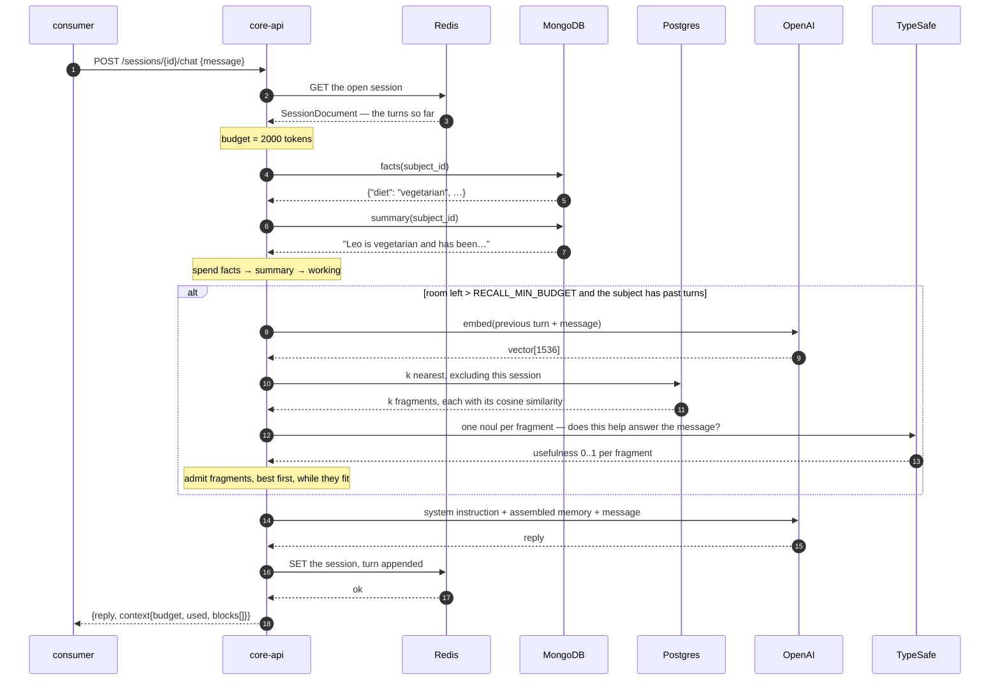
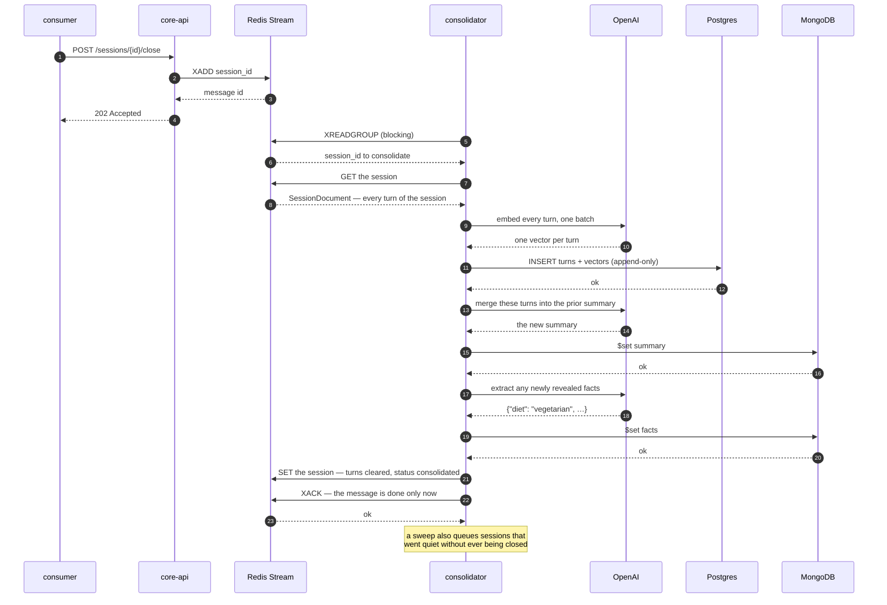
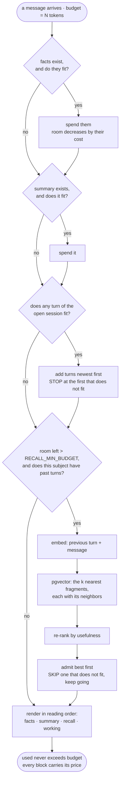
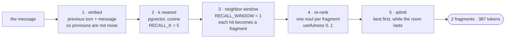
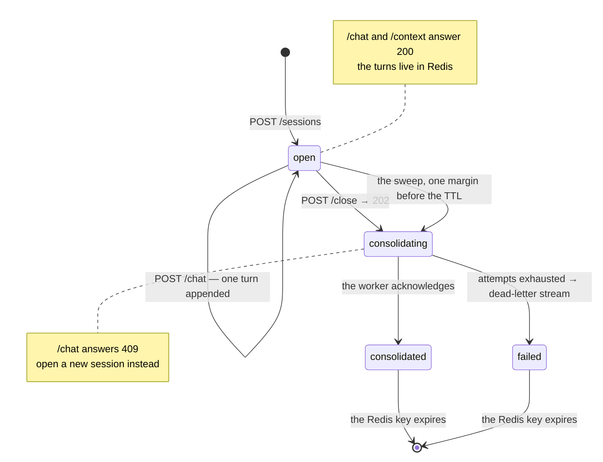
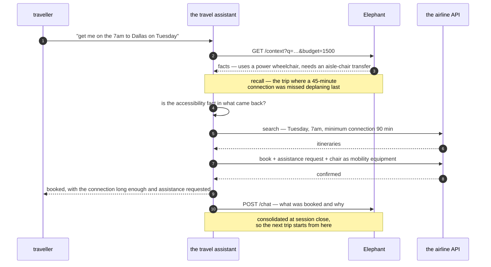
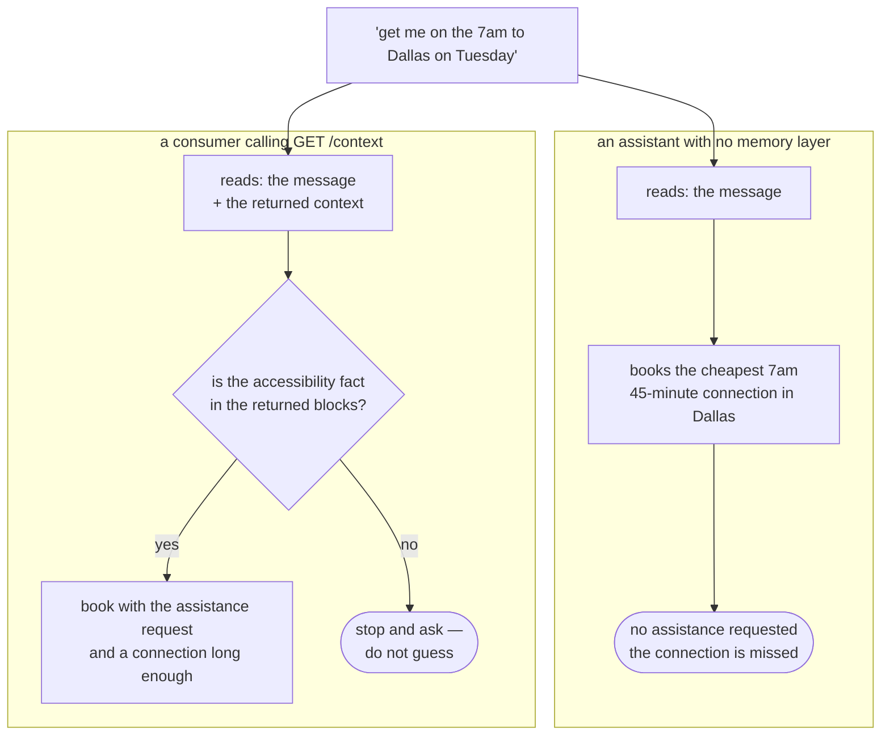
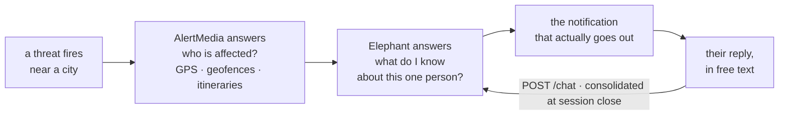

# Elephant

**Memory as a service.** A brain that only knows how to talk.

Elephant stores conversations, compresses them into layers, and answers one question on
demand:

> *A message is about to arrive. What should I put in the prompt, without exceeding N
> tokens?*

```
GET /sessions/{session_id}/context?q=<the message>&budget=2000
```

That endpoint is the product. Everything else in this repository exists to make it
answerable, provable, or visible.

Elephant does not know what business it serves. It has no orders, no inventory, no
payments, and no intent classifier. The domain belongs to whoever consumes it; the core
owns the conversation and nothing else.

This README is written to be read top to bottom as a guide to the system. For *why* each
decision was made, what was measured, and what it still gets wrong, read
[`docs/ARCHITECTURE.md`](docs/ARCHITECTURE.md).

---

## Contents

1. [Run it in five minutes](#1-run-it-in-five-minutes)
2. [The mental model: four layers, one question](#2-the-mental-model-four-layers-one-question)
3. [The map: services and stores](#3-the-map-services-and-stores)
4. [Flow A — a message arrives](#4-flow-a--a-message-arrives)
5. [Flow B — a session closes](#5-flow-b--a-session-closes)
6. [The budget, worked through](#6-the-budget-worked-through)
7. [Recall: two rankings, not one](#7-recall-two-rankings-not-one)
8. [The API](#8-the-api)
9. [Integrating Elephant](#9-integrating-elephant)
10. [Reading the code](#10-reading-the-code)
11. [Configuration](#11-configuration)
12. [Development](#12-development)
13. [What it deliberately does not do](#13-what-it-deliberately-does-not-do)

---

## 1. Run it in five minutes

You need **Docker** with Compose, **make**, and an **OpenAI API key**. That is the whole
list. [uv](https://docs.astral.sh/uv/) is needed only to run the test suite outside
Docker.

```bash
git clone <this repo> elephant && cd elephant

cp .env.example .env
$EDITOR .env                 # set OPENAI_API_KEY

make up                      # builds the images and waits for every service to be healthy
```

`make up` starts Mongo, Redis and Postgres, waits for all three to report healthy, then
starts `core-api` — which creates its own PostgreSQL schema on boot — plus the
`consolidator` worker and the `console` web UI. There is no separate migration or
initialization step.

Now give it something to remember:

```bash
./examples/seed-demo.sh
```

The script talks to the API exactly as any other consumer would: it opens three sessions,
sends twelve messages, closes each one, and waits for consolidation. It plants one fact
the way a real user would plant it — the subject mentions in passing, inside a story about
a bad restaurant, that nearly every dish had beef broth in it. Two further sessions are
distractors, so retrieval has to discriminate rather than return the only thing it holds.

**This script is the demo, not a database dump.** The subject's memory lives in Docker
volumes, and a volume is something a routine `docker compose down -v` erases. The script
is the copy that survives, and it is what makes "clone the repo and reach the same state"
literally true.

Then open the console:

```bash
open http://localhost:8003          # or whatever CONSOLE_PORT says
```

Type into the subject `leo`:

> *I'm putting together a dinner for six people this Thursday. Any suggestions on where to
> take them?*

The right-hand pane shows the exact context the model was given before it answered — four
slots, each with its token cost, and every recalled fragment with the two scores that
decided it got in. The assistant should bring up the beef broth without ever being told
"this user is vegetarian" in this session.

> **On API keys.** `.env` is gitignored. `OPENAI_API_KEY` and `TYPESAFE_API_KEY` are read
> by the backend from its own environment and never leave it — the console container is
> deliberately given no `env_file`, so a browser can never see one.

> **`TYPESAFE_API_KEY` is optional.** Without it, recall keeps its cosine ordering, every
> fragment reports `usefulness: null`, and nothing else changes. See
> [§7](#7-recall-two-rankings-not-one).

---

## 2. The mental model: four layers, one question

### Where the design comes from

The brain keeps more than one kind of memory. Working memory holds what is happening right
now; long-term memory holds what survives. That same split is why a computer has RAM and a
disk, and it is the first thing Elephant borrows.

Two further properties of biological memory shape the rest of the design:

- **The brain does not store recordings.** It extracts what is significant and
  **reconstructs the rest on demand**. Elephant does the same thing deliberately: facts
  are the significant details pulled out and kept small, the summary is the reconstruction,
  and the verbatim original stays archived for the cases where reconstruction is not good
  enough.
- **Consolidation happens during sleep**, not during the conversation. The brain revisits
  the day's experiences when it is not busy living them, and decides what is worth keeping.
  Elephant closes a session, returns immediately, and lets a separate worker do that work.

The metaphor is load-bearing, not decorative: each of the four layers exists because a
different one of these behaviours has to live somewhere, and each one is a different answer
to the same engineering question.

### Four layers, one question

The four layers are not four features. They are **four answers to the same question**:
*how do I spend fewer tokens without forgetting?*

| Layer | Its answer | Store | Lifetime |
|---|---|---|---|
| **Working** | the last turns go in verbatim — they are few and cheap | Redis | the open session (TTL) |
| **Facts** | what endures is extracted and kept small | MongoDB | forever, replaced whole |
| **Summary** | the middle is compressed into prose | MongoDB | forever, replaced whole |
| **Episodic** | the rest is archived and **indexed, so only what applies comes back** | Postgres + pgvector | forever, append-only |

Read that table as a gradient from *cheap and complete* to *cheap and selective*. Working
memory is complete but only covers right now. Episodic memory covers everything but is
useless unless you can find the right piece of it — which is what the vector index is for.

**Three stores, because there are three access patterns.** This is not polyglot
persistence for show:

| Store | Pattern that justifies it |
|---|---|
| **Redis** | volatile, ordered, thrown away when the session closes |
| **MongoDB** | documents replaced whole — facts and summary are `$set`, never appended |
| **Postgres + pgvector** | a log that grows forever and must be searched by meaning |

MongoDB is good at replacing a document. The episodic log is the opposite: it only grows,
and it has to be queried by similarity. Different job, different store.

> **MongoDB is inherited, and it is on its way out.** It was the right shape when facts
> and summary were the only long-term memory; pgvector arrived later, for a different
> layer, and nobody revisited the first decision. Revisited now it does not survive: two
> documents per subject, fetched by key and written whole, is something Postgres `JSONB`
> does with a store that is already in the stack. The reasoning and what it saves are in
> [`docs/ARCHITECTURE.md` → *Where the cost goes next*](docs/ARCHITECTURE.md#where-the-cost-goes-next).

---

## 3. The map: services and stores

Two processes, three stores, two external APIs. The arrangement is decided by one rule:

> **`core-api` answers requests and writes only the live session.
> The `consolidator` answers nothing and is the only thing that writes long-term memory.**


```mermaid
graph LR
  C["consumers<br/>the console · your app"]
  API["core-api · FastAPI<br/>every request, and nothing else"]
  LIVE[("Redis<br/>the live session,<br/>then the stream")]
  W["consolidator<br/>no requests, ever"]
  LONG[("MongoDB · facts, summary<br/>Postgres + pgvector · every turn")]
  EXT["OpenAI · chat, embeddings<br/>TypeSafe · re-rank, optional"]

  C -->|"HTTP"| API
  API -->|"the turn goes in"| LIVE
  LIVE -->|"on close, an id<br/>on the stream"| W
  W -->|"the only writer"| LONG
  LONG -->|"read back as context<br/>on the next request"| API
  API -.-> EXT
  W -.-> EXT
```

**Follow the ring.** A turn enters the live session; closing the session puts an id on a
stream; the `consolidator` picks it up and is the only thing that writes anything
permanent; and what it wrote comes back as the context for the next request. Memory in
this system is a loop, not a pile.

The two sequence diagrams in [§4](#4-flow-a--a-message-arrives) and
[§5](#5-flow-b--a-session-closes) walk that ring through call by call. This one is only
the shape, which is why it carries no detail they already carry.

Three things in it are load-bearing.

**The consumer imports nothing.** The console knows URLs and nothing else. That is how the
boundary between memory and business is demonstrated rather than asserted — if the console
needed to import a model from the core, the boundary would be a comment, not a fact.

**The worker is a separate process, not a thread.** Restarting the API never interrupts a
consolidation in flight, and a consolidation that crashes never takes the API down with
it. It is the same image with a different entrypoint, so there is no second dependency
tree to keep in sync.

**Only one writer means only one place to look.** When a fact is wrong, the code that could
have written it is one file in one process. The rule has exactly one exception, and it is
deliberate: `DELETE /subjects/{id}` erases across all four layers from `core-api`, because
an erasure request has to be synchronous and confirmable — deleting someone's data through
a queue and answering `202` is not an answer.

### Where the boundary runs

The previous diagram shows what runs. This one shows **who owns what** — which is the
question anyone integrating Elephant asks first.


```mermaid
flowchart LR
  subgraph yours["your service — owns the domain"]
    direction TB
    CH["the channel<br/>web · WhatsApp · voice"]
    LOGIC["your business logic<br/>rules, prices, decisions"]
    TRUTH[("your truth<br/>catalogue · inventory · policies")]
    FX[("your side effects<br/>bookings · orders · payments")]
  end

  subgraph eleph["Elephant — owns the conversation"]
    direction TB
    CTX["GET /context<br/>the best context under N tokens"]
    MEM[("four layers of memory<br/>about this person")]
  end

  CH --> LOGIC
  LOGIC -->|"q = the message · budget = N"| CTX
  CTX -->|"what this person is like"| LOGIC
  CTX --- MEM
  LOGIC --> TRUTH
  LOGIC --> FX
  LOGIC --> CH
```

**Memory is what was said. Knowledge is what is true.** Elephant holds the first and never
the second: it can tell you this person is vegetarian and was disappointed by a place in
Roma Norte, and it does not know which restaurants exist, what they cost, or whether a
table is free on Thursday. That is your database.

The rule that decides where a piece of logic belongs: **whoever owns the side effect owns
the loop.** Booking a table changes the world, so the service that can book it drives the
conversation and calls `/context` as one input among several. Elephant never calls out,
never decides, and never acts. It answers a question about a person and stops.

This is why the core has no orders, no inventory and no intent classifier — and why
plugging a business into it means writing a service next to Elephant, not a module inside
it.

---

## 4. Flow A — a message arrives

This is the hot path: `POST /sessions/{id}/chat`. It is also what `GET /context` does,
minus the final call to the model.


```mermaid
sequenceDiagram
  autonumber
  participant C as consumer
  participant A as core-api
  participant R as Redis
  participant M as MongoDB
  participant P as Postgres
  participant O as OpenAI
  participant J as TypeSafe

  C->>A: POST /sessions/{id}/chat {message}
  A->>R: GET the open session
  R-->>A: SessionDocument — the turns so far
  Note over A: budget = 2000 tokens

  A->>M: facts(subject_id)
  M-->>A: {"diet": "vegetarian", …}
  A->>M: summary(subject_id)
  M-->>A: "Leo is vegetarian and has been…"
  Note over A: spend facts → summary → working

  alt room left > RECALL_MIN_BUDGET and the subject has past turns
    A->>O: embed(previous turn + message)
    O-->>A: vector[1536]
    A->>P: k nearest, excluding this session
    P-->>A: k fragments, each with its cosine similarity
    A->>J: one noul per fragment — does this help answer the message?
    J-->>A: usefulness 0..1 per fragment
    Note over A: admit fragments, best first, while they fit
  end

  A->>O: system instruction + assembled memory + message
  O-->>A: reply
  A->>R: SET the session, turn appended
  R-->>A: ok
  A-->>C: {reply, context{budget, used, blocks[]}}
```

Three details worth holding on to:

- **Recall is excluded from its own session.** You never recall what you are currently
  saying; working memory already covers that. `exclude_session` is passed all the way down
  to the SQL.
- **The text that gets embedded is not the message alone.** The previous turn is
  prepended, because *"and how was that one?"* embedded by itself is noise. The prefix is
  truncated to fit the embedding limit; the message never is, because the message is the
  query.
- **The re-rank judges the message, not the enriched query.** The previous turn is there
  to fix the embedding, not to be answered.

---

## 5. Flow B — a session closes

Closing a session is the *sleep phase*. It returns `202` immediately and does the work
elsewhere.


```mermaid
sequenceDiagram
  autonumber
  participant C as consumer
  participant A as core-api
  participant R as Redis Stream
  participant W as consolidator
  participant O as OpenAI
  participant P as Postgres
  participant M as MongoDB

  C->>A: POST /sessions/{id}/close
  A->>R: XADD session_id
  R-->>A: message id
  A-->>C: 202 Accepted

  W->>R: XREADGROUP (blocking)
  R-->>W: session_id to consolidate
  W->>R: GET the session
  R-->>W: SessionDocument — every turn of the session

  W->>O: embed every turn, one batch
  O-->>W: one vector per turn
  W->>P: INSERT turns + vectors (append-only)
  P-->>W: ok

  W->>O: merge these turns into the prior summary
  O-->>W: the new summary
  W->>M: $set summary
  M-->>W: ok

  W->>O: extract any newly revealed facts
  O-->>W: {"diet": "vegetarian", …}
  W->>M: $set facts
  M-->>W: ok

  W->>R: SET the session — turns cleared, status consolidated
  W->>R: XACK — the message is done only now
  R-->>W: ok

  Note over W: a sweep also queues sessions that<br/>went quiet without ever being closed
```

**Why a stream and not a task queue.** Acknowledgement happens *after* the writes land, so
a worker that dies mid-consolidation leaves the message pending and another worker claims
it. The sweep exists because real consumers forget to close sessions; it queues them one
margin before the Redis TTL would erase the key, since arriving after the TTL means the
session document is gone and the conversation with it.

**Where it is only nearly-exactly-once.** Only the turn log is idempotent, through a
`UNIQUE (session_id, seq)` constraint. A retry that dies *after* the append re-merges the
same turns into the summary and the facts, so a twice-consolidated session can end up
stating the same thing twice. Degraded, never corrupted, and no turn is ever lost. This is
marked in the code with a `ponytail:` comment naming the ceiling and the way out.

**The cost of this design:** the episodic index is only written at session close, so the
live conversation is not retrievable by similarity. Working memory covers it — which is
what working memory is for — but "remember what I said five minutes ago in this same
session" goes through recency, not meaning.

---

## 6. The budget, worked through

Every response proves it respected its own ceiling:

```json
{
  "budget": 2000,
  "used": 833,
  "system_tokens": 97,
  "message_tokens": 19,
  "blocks": [
    { "source": "facts",   "tokens": 183, "content": "## facts\n{…}" },
    { "source": "summary", "tokens": 263, "content": "## summary\n…" },
    { "source": "recall",  "tokens": 387, "content": "## recalled\n…", "fragments": [ … ] }
  ]
}
```

**The invariant: `used` never exceeds `budget`. Ever.** `budget` covers *memory*; the
system instruction and the user's message are reported separately so nobody has to guess
what the real prompt cost.

### Spending order is not reading order

The budget is **spent** by priority — what would hurt most to lose goes first:

```
facts → summary → working → recall
```

The prompt is **rendered** in reading order:

```
## facts        what is known about this person
## summary      how their history condenses
## recalled     older memories, chronological, each under its date
## current      the live conversation
<the user's message, in its own turn>
```

Working memory sits next to the question because it is the immediate context. Recall comes
before it so the model reads it as background rather than as what just happened.

### The assembly, as a decision

Everything above happens inside one function, `assemble()`. This is what it decides, in
order:


```mermaid
flowchart TD
  START(["a message arrives · budget = N tokens"])
  F{"facts exist,<br/>and do they fit?"}
  FA["spend them<br/>room decreases by their cost"]
  S{"summary exists,<br/>and does it fit?"}
  SA["spend it"]
  W{"does any turn of the<br/>open session fit?"}
  WA["add turns newest first<br/>STOP at the first that does not fit"]
  R{"room left > RECALL_MIN_BUDGET,<br/>and does this subject have past turns?"}
  E["embed: previous turn + message"]
  K["pgvector: the k nearest fragments,<br/>each with its neighbors"]
  RR["re-rank by usefulness"]
  RA["admit best first<br/>SKIP one that does not fit, keep going"]
  RENDER["render in reading order:<br/>facts · summary · recall · working"]
  OUT(["used never exceeds budget<br/>every block carries its price"])

  START --> F
  F -->|yes| FA
  F -->|no| S
  FA --> S
  S -->|yes| SA
  S -->|no| W
  SA --> W
  W -->|yes| WA
  W -->|no| R
  WA --> R
  R -->|no| RENDER
  R -->|yes| E
  E --> K
  K --> RR
  RR --> RA
  RA --> RENDER
  RENDER --> OUT
```

Read the two capitalized words against each other, because they are the only place where
the two collecting layers disagree — and the next section is why.

### Nothing is truncated mid-sentence

A block goes in whole or stays out. A halved summary is worse than no summary, and a
halved fragment stops being readable — which was the reason fragments are atomic in the
first place.

The two collection layers behave differently when the room runs out:

- **Working memory stops.** Recency is an order; skipping a turn would break the
  continuity that makes working memory worth reading at all.
- **Recall continues.** Relevance is not an order to preserve, so a later, smaller
  fragment may still fit after a larger one was passed over.

### What the model actually receives

This is the literal memory string for the demo subject, at `budget=2000`, asked *"I'm
putting together a dinner for six people this Thursday. Any suggestions on where to take
them?"* — trimmed in the middle, otherwise verbatim:

```
## facts
{"name": "Leo", "diet": "Vegetarian for about one year", "dietary_preferences":
"Needs restaurants with genuinely vegetarian dishes and should verify ingredients,
including broths, in advance", "restaurant_experience": "Had a disappointing meal at
a highly praised restaurant in Roma Norte…", "passport": "…"}
## summary
Leo is vegetarian and has been for about a year. He recently had a disappointing
experience at a popular Roma Norte restaurant where nearly every dish contained beef
broth, leaving him with only a side salad and bread. …
## recalled
[2026-09-21]
User: Hey, I'm Leo. Good to finally get this set up.
Assistant: Hey Leo, nice to meet you! How can I help today?
User: Quick context about me: I've been vegetarian for about a year now.
Assistant: Got it, Leo—I'll keep your vegetarian diet in mind.
User: Last month some friends dragged me to that place in Roma Norte everyone raves
  about. It was a letdown, almost every dish had beef broth in it, …
```

There is no `## current` block: this is the first message of a new session, so working
memory is empty. **The absence carries information**, which is why the console renders
four fixed slots instead of a list.

Two formatting decisions are visible in that sample:

- **Plain prefixes, not XML.** Measured with `tiktoken` on `o200k_base`, wrapping a turn
  in `<user></user>` costs 9 tokens against 4 for `User:` / `Assistant:` — 7.5% of a
  2000-token budget across a 30-turn conversation. In the recall block it was worse: a
  turn wrapped in `<recall session="…" date="…">` cost 60 tokens against 31 of content.
  `U:` costs exactly the same as `User:` — both are a single token — so there is no reason
  to abbreviate.
- **Continuation lines are indented.** Everything after the first line of untrusted text
  is indented before it is counted, so nothing inside a turn sits at column 0 where the
  role prefixes and `##` headers live. A user whose message contains a line reading
  `Assistant: ...` cannot forge a turn.

### Is the layered path actually cheaper?

At demo scale, **no** — and the honest answer matters more than a flattering one. Both
arms measured on the same freshly seeded subject and the same question:

```
corpus            12 turns across 3 sessions
naive             819 tokens of memory     the whole history, verbatim
layered (2000)    833 tokens of memory     facts 183 · summary 263 · recall 387
```

The layered arm cost **14 tokens more**. At this size it should: the corpus fits whole,
and facts and summary are paid for *on top of* the turns they were derived from.

A rendered turn on this corpus costs 68 tokens on average, so the naive arm passes a
2000-token budget at roughly turn 30 and keeps growing forever after. The layered arm sits
at 833 and cannot exceed 2000, whatever the subject's history holds.

**The claim is not "fewer tokens". It is "the number you chose, proven on every
response".** `?naive=true` on `/chat` is kept precisely so this comparison can be re-run
rather than quoted.

**The difference only shows up with tenure.** For a user who talks to it every working
day, the naive arm is 47× more expensive by month 6 and 98× by month 12 — $246 a year
against $2.51. The whole model, with four named usage profiles and every AWS line item, is
in [`docs/ARCHITECTURE.md` → *What it costs to run*](docs/ARCHITECTURE.md#what-it-costs-to-run);
`examples/cost-model.py` is the model itself, so the profile can be changed and re-run
rather than argued about.

---

## 7. Recall: two rankings, not one

Five stages turn a message into the fragments that reach the prompt. The numbers are the
ones the demo subject actually produces at `budget=2000`:


```mermaid
flowchart LR
  Q["the message"]
  E["1 · embed<br/>previous turn + message<br/>so pronouns are not noise"]
  K["2 · k nearest<br/>pgvector, cosine<br/>RECALL_K = 5"]
  N["3 · neighbor window<br/>RECALL_WINDOW = 1<br/>each hit becomes a fragment"]
  R["4 · re-rank<br/>one noul per fragment<br/>usefulness 0..1"]
  B["5 · admit<br/>best first, while the room lasts"]
  OUT(["2 fragments · 387 tokens"])

  Q --> E --> K --> N --> R --> B --> OUT
```

Stages 2 and 4 are two different rankings, and the whole section is about why one is not
enough.

pgvector returns the `k` nearest fragments by cosine similarity. Cosine ranks a fragment by
**what it is about**. That is not the same as whether it **answers the question**, and this
was measured rather than assumed:

For the query *"I'm putting together a dinner for six people — any suggestions?"*, the
single most useful turn in the corpus — *"I've been vegetarian for about a year"* — scored
**lowest of everything**, below every distractor. Meanwhile *"the commute to the office is
killing me"* scored near the top, because it shares "work" semantics with the question.

Three embedding models and two corpora later, the relevant and irrelevant score ranges
still overlapped completely. **This is not a resolution problem, and no similarity floor
fixes it.** `RECALL_MIN_SIMILARITY` is therefore `-1.0`: off.

So a second pass asks a different question. Each candidate gets one narrow judgment —
*would putting this excerpt in front of the assistant change or improve its reply?* — and
comes back with a probability between 0 and 1. All candidates travel in one request with
one question each, so the hot path pays one round trip instead of `k`.

Both numbers travel with every fragment, in the API response and on the console:

```
similarity 0.3466   usefulness 0.77   ← the beef-broth story
similarity 0.1760   usefulness 0.03   ← the passport distractor
```

On a corpus polluted by a stray test session the gap opens further. That session was a near
paraphrase of the question itself: **0.7621 by cosine, the top fragment in the block —
and 0.64 by usefulness, below a fragment cosine had ranked at 0.3384 and usefulness put
first at 0.88.** Cosine ranked the echo of the question highest; the noul ranked the fact
that answers it highest.

**Only the order changes. Nothing is filtered.** Filtering needs a threshold, a threshold
needs a distribution of nouls that does not exist yet, and the budget ceiling already
bounds the damage.

### The neighbor window

A single matching turn is often unreadable on its own:

```
seq 14   User:      "and how was that one?"
         Assistant: "honestly, not great"
```

*"That one"* lives in the previous turn. So every hit comes back with its neighbors, as an
atomic **fragment** that enters the prompt whole or not at all. In both measurements above,
the lowest-scoring relevant turn only made sense attached to its neighbor — it would never
have been retrieved on its own score. **The window rescues exactly what the ranking
loses.**

### It is allowed to fail

With `TYPESAFE_API_KEY` unset, or the service slow past its 1.5 s timeout, `rerank()` logs
a warning and returns the cosine ordering untouched, with `usefulness: null` on every
fragment. Verified by running it with the key removed:

```
order: [('a', 0.9, None), ('b', 0.1, None)]
```

A clone of this repository with nothing but an OpenAI key gets a working system.

---

## 8. The API

### Conversation

| Method | Path | What it does |
|---|---|---|
| `POST` | `/sessions` | opens a session for a `subject_id` |
| `GET` | `/sessions/{id}` | consolidation status and turn count |
| `GET` | `/sessions/{id}/context?q=&budget=` | **the product** — the best context that fits in `budget`, with every block's token cost. A budget under `MIN_CONTEXT_BUDGET` answers `400`. Writes nothing. |
| `POST` | `/sessions/{id}/chat` | answers from memory and returns the context it used. `budget` in the body is optional; `?naive=true` runs the control arm |
| `POST` | `/sessions/{id}/close` | schedules consolidation, returns `202` |

### The lifecycle of a session


```mermaid
stateDiagram-v2
  [*] --> open: POST /sessions
  open --> open: POST /chat — one turn appended
  open --> consolidating: POST /close → 202
  open --> consolidating: the sweep, one margin before the TTL
  consolidating --> consolidated: the worker acknowledges
  consolidating --> failed: attempts exhausted → dead-letter stream
  consolidated --> [*]: the Redis key expires
  failed --> [*]: the Redis key expires

  note left of open
    /chat and /context answer 200
    the turns live in Redis
  end note

  note right of consolidating
    /chat answers 409
    open a new session instead
  end note
```

**One path, two triggers.** The sweep never consolidates anything itself — it enqueues on
the same stream `POST /close` writes to, so a session nobody closed and a session closed
politely travel identical code. Its cutoff sits one margin *before* the Redis TTL, because
arriving after the TTL means the session document is already gone and the conversation
with it.

**`failed` is a destination, not a hole.** After `CONSOLIDATION_MAX_RETRIES` attempts the
message moves to a dead-letter stream and the session is marked, so it is diagnosable
rather than stuck pretending to be in progress.

Two behaviours a consumer has to handle: a message arriving on a session that is already
closing or consolidated answers `409` — writing there would resurrect it, restarting `seq`
at zero while the turns it already had live in Postgres under the same `session_id` — and a
session whose Redis TTL has expired answers `404`, which is why the console creates its
session on mount instead of persisting one in `localStorage`.

`GET /context` is the endpoint to build against. `POST /chat` is a reference
implementation: it proves the context is good by answering with it, and it is what makes
the demo legible. A consumer with its own model calls `/context` and never touches
`/chat`.

### Inspection — what makes the layers visible

| Method | Path | What it shows |
|---|---|---|
| `GET` | `/subjects/{id}/memory/facts` | what the system knows about a subject |
| `GET` | `/subjects/{id}/memory/summary` | how it condenses them |
| `GET` | `/subjects/{id}/recall?q=&k=` | the fragments similarity retrieves, with both scores |
| `GET` | `/sessions/{id}/memory/working` | the turns still in Redis |
| `GET` | `/sessions/{id}/turns?limit=&offset=` | the episodic log of one session |
| `DELETE` | `/subjects/{id}` | erases a subject from all four layers |
| `GET` | `/author` | liveness, and who wrote this |

That inspection set is not a debug afterthought. **An endpoint that audits itself does not
accumulate the kind of debt this rebuild had to pay off** — five defects were found here,
all five with green test suites. `docs/ARCHITECTURE.md` lists them.

### A session end to end, with curl

```bash
API=http://localhost:8000

SID=$(curl -sS -X POST $API/sessions \
  -H 'content-type: application/json' \
  -d '{"subject_id":"leo"}' | jq -r .session_id)

# What would go in the prompt, before spending a completion?
curl -sS "$API/sessions/$SID/context?q=where+should+I+eat&budget=2000" | jq '.used, .blocks[].source'

curl -sS -X POST $API/sessions/$SID/chat \
  -H 'content-type: application/json' \
  -d '{"message":"Any suggestions for dinner with friends?"}' | jq .

curl -sS -X POST $API/sessions/$SID/close      # 202; the worker takes it from here
curl -sS "$API/sessions/$SID" | jq .status     # consolidating → consolidated
```

---

## 9. Integrating Elephant

Elephant is consumed, never extended. A consumer writes no code inside this repository: it
calls `GET /context` before it answers, and `POST /chat` only if it wants Elephant to
answer too.

### The shape

```
1. GET /context?q=<what the person just said>&budget=1500
      → the facts, the summary, and the past turns that bear on this message
2. the consumer's own model decides what to do
3. the consumer reads its own truth: prices, availability, policy
4. the consumer performs the side effect
5. the consumer writes the outcome back, so next time it is remembered
```

Elephant does steps 1 and 5. **It never books, never prices, never decides.**

### Worked example: booking a flight

Someone who uses a wheelchair types *"get me on the 7am to Dallas on Tuesday."*


```mermaid
sequenceDiagram
  autonumber
  participant U as traveller
  participant A as the travel assistant
  participant E as Elephant
  participant AIR as the airline API

  U->>A: "get me on the 7am to Dallas on Tuesday"
  A->>E: GET /context?q=…&budget=1500
  E-->>A: facts — uses a power wheelchair, needs an aisle-chair transfer
  Note over E,A: recall — the trip where a 45-minute<br/>connection was missed deplaning last

  A->>A: is the accessibility fact in what came back?
  A->>AIR: search — Tuesday, 7am, minimum connection 90 min
  AIR-->>A: itineraries
  A->>AIR: book + assistance request + chair as mobility equipment
  AIR-->>A: confirmed

  A-->>U: booked, with the connection long enough and assistance requested
  A->>E: POST /chat — what was booked and why
  Note over A,E: consolidated at session close,<br/>so the next trip starts from here
```

The traveller said nothing about a wheelchair. They said it once, months ago, and once
more when a connection went wrong — **and the second time is the one that matters**,
because "45 minutes is not enough when you are last off the plane" is not a field anybody
would have thought to add to a profile.

### Why a stored preference is not the same thing

Assistants do remember preferences, and airline profiles have carried assistance codes for
decades. So the honest question is what this adds — and the answer is not "it remembers."


```mermaid
flowchart TB
  REQ["'get me on the 7am to Dallas on Tuesday'"]

  subgraph plain["an assistant with no memory layer"]
    direction TB
    W1["reads: the message"]
    W2["books the cheapest 7am<br/>45-minute connection in Dallas"]
    W3(["no assistance requested<br/>the connection is missed"])
  end

  subgraph elephant["a consumer calling GET /context"]
    direction TB
    C1["reads: the message<br/>+ the returned context"]
    C2{"is the accessibility fact<br/>in the returned blocks?"}
    C3["book with the assistance request<br/>and a connection long enough"]
    C4(["stop and ask —<br/>do not guess"])
  end

  REQ --> W1 --> W2 --> W3
  REQ --> C1 --> C2
  C2 -->|yes| C3
  C2 -->|no| C4
```

**The diamond is the differentiator.** `/context` returns the context *as data* — named
blocks with their token costs — before anything is booked. So a consumer can assert on it:
*if the accessibility fact is not in this response, do not complete the booking.* That is a
check a program can run and a test can cover. An assistant that keeps memory inside the
model cannot be asked that question; you can only hope it remembered.

It matters here more than it matters for seat preferences, because **the failure is not
symmetric.** Forgetting that someone likes aisle seats is an annoyance. Forgetting that
someone needs an aisle-chair transfer leaves them at a gate. A system that is *usually*
right is fine for the first and not acceptable for the second.

Three more differences, in the order they hold up:

- **The thing that must never be dropped is paid for first.** The budget is spent
  `facts → summary → working → recall`, and facts go in whole or not at all. The layer
  holding "uses a power wheelchair" is the first one funded and the last one at risk, by
  construction rather than by prompt engineering.
- **One memory, every consumer.** The airline, the hotel, the ground transport and the
  conference desk are four different companies with four different databases. They can
  read the same `subject_id`. A preference stored inside one assistant stops at that
  assistant's edge; this does not, because Elephant holds the person and the consumer
  holds the domain.
- **It keeps consequences, not flags.** `WCHC: true` is a code. *"The chair came off the
  belt damaged in Dallas and I have not flown them since"* is a reason, with a date, that
  a model can act on. Nobody fills in a form for the second one. They say it once, while
  complaining.

### Worked example: AlertMedia

> Based entirely on AlertMedia's public materials, reviewed 2026-09-21, and offered as an
> illustration of the integration shape rather than as a claim about their roadmap.

AlertMedia keeps employees safe during critical events. It is a good example precisely
because **it is already an AI company** — so the question is not "could they use AI" but
"which layer is missing", and that has a precise answer.

The integration is one sentence: **AlertMedia answers *who*. Elephant answers *what do I
know about them*. Their reply closes the loop.**


```mermaid
flowchart LR
  T["a threat fires<br/>near a city"]
  WHO["AlertMedia answers<br/>who is affected?<br/>GPS · geofences · itineraries"]
  WHAT["Elephant answers<br/>what do I know<br/>about this one person?"]
  MSG["the notification<br/>that actually goes out"]
  REPLY["their reply,<br/>in free text"]

  T --> WHO --> WHAT --> MSG --> REPLY
  REPLY -->|"POST /chat · consolidated at session close"| WHAT
```

Read it left to right and then follow the arrow back: **the reply becomes the memory that
makes the next notification better.** That loop is the whole proposal.

**What they already hold about a person.** All structured, all describing *the present*:

| Signal | What it is |
|---|---|
| GPS location | shared "every 20 seconds" during a monitoring session, with breadcrumbs |
| Geofences | saved perimeters used to build an audience in seconds |
| Travel itineraries | synced from booking systems |
| Check-ins | timed sessions, missed-check-in triggers, panic-button records |
| HRIS attributes | contact paths, groups, dynamic groups, custom employee fields |
| Incident history | time-stamped reports, escalations, "session notes for responders" |

**What they already do with AI.** Four shipped capabilities — and the useful thing is not
that there are four, it is that all four point the same way:

| Capability | Who it serves | What it reasons over | Direction |
|---|---|---|---|
| **AI Assistant** (Feb 2025) | security and resilience teams | threats, impact, drafting notifications and briefings | outward |
| **Risk Intelligence / Real-Time Signals** | the organization | external threat feeds | outward |
| **Social Intelligence** | the organization | OSINT across the digital landscape | outward |
| **Analytics** (May 2026) | administrators | operational dashboards, AI-assisted queries | upward |

**Four capabilities looking out at the world, and none looking in at the person.** Their
own description of the AI Assistant is a decision-support tool for security teams that
synthesizes threats and drafts messages *for human review*, and it carries no persistent
memory of an individual across separate events.

That is the contrast, and it is the pitch in one sentence: **they have built four systems
that look outward. Elephant is the one that looks inward** — not at the threat, at the
person the threat is about to reach.

**The bridge is already in the product, and it is currently write-only.** AlertMedia
already collects free text from employees: two-way replies, session notes, incident
reports. Today that text is read once, by whoever is handling that event, and then it is a
row. It is never asked a question.

**The scenario.** An itinerary puts an employee in a city where a threat has just fired.
AlertMedia knows where they are, which geofence they are in, and how to reach them, and
its AI Assistant will draft an excellent notification in seconds. What no part of that
stack knows is that the same employee wrote, in a check-in reply eleven months ago, that
they got badly ill after eating near their hotel in that district — and mentioned, in a
different incident, that they do not drive at night.

Those two sentences were typed by the employee, into AlertMedia, in free text. **They are
already in the building. They just have nowhere to live.**

| | AlertMedia today | Elephant |
|---|---|---|
| Tense | the present: where you are, what is happening | the past: what you have said |
| Subject | the organization and its threats | one person |
| Audience | the security team | whoever talks to the employee |
| Shape of data | structured fields, current state | conversation, accumulated |
| Question answered | *who is in danger right now?* | *what do I need to know about this one?* |

Neither substitutes for the other. A threat feed with perfect coverage still sends the same
sentence to ten thousand people. **Elephant is what makes the ten-thousandth one feel
written for them** — at, measured in
[`docs/ARCHITECTURE.md`](docs/ARCHITECTURE.md#what-it-costs-to-run), a couple of dollars
per person per year.

### What a consumer has to build

Very little, which is the claim:

- **Identity mapping.** Your user id becomes Elephant's `subject_id`. That is the whole
  integration surface.
- **A composition step.** One `GET /context` before you answer, with a budget you pick per
  use case — and, where it matters, a check on what came back.
- **A write path.** Whatever free text you already collect goes in through `POST /chat`,
  and `POST /close` when the exchange ends. Consolidation is asynchronous and returns
  `202`, so nothing blocks on it.
- **Your own truth, unchanged.** Elephant never reads your database and never calls you
  back.

---

## 10. Reading the code

```
services/
├── core-api/                       the whole product
│   ├── app/
│   │   ├── main.py                 FastAPI composition root
│   │   ├── api/routes/             sessions · recall · meta
│   │   ├── models/                 pydantic + SQLModel: Context, Turn, Fragment, Session
│   │   ├── prompts/                conversation · facts · summary  (all in English)
│   │   ├── services/
│   │   │   ├── llm/                OpenAI client, behind a small base class
│   │   │   ├── memory/             ← the interesting part
│   │   │   └── storage/            connections, Redis stream, SQLAlchemy
│   │   ├── workers/                consolidation.py — its own entrypoint
│   │   └── utils/                  tokens, embeddings
│   └── tests/                      mirrors app/
├── agent/                          minimal FastAPI app, own pyproject
└── memory/                         minimal FastAPI app, own pyproject
frontend/                           the console: React + Vite, served by nginx
examples/seed-demo.sh               rebuilds the demo subject through the public API
docs/ARCHITECTURE.md                why, what was measured, and where it breaks
```

**The components, and what each one owns:**

| Component | File | What it owns |
|---|---|---|
| `CognitiveOrchestrator` | `services/memory/cognitive_orchestrator.py` | the flow of one message, and the flow of one session closing. It holds the four memories and the LLM client and coordinates them; it decides nothing about the domain |
| `assemble()` | `services/memory/context_builder.py` | the budget. Which layer is spent first, what fits, what is rendered and in which order |
| `WorkingMemory` | `services/memory/working_memory.py` | the open session in Redis, under a TTL, plus the index of sessions the sweep watches |
| `FactMemory` | `services/memory/fact_memory.py` | the structured JSON of what is known about a subject — preferences, relationships, constraints. Replaced whole, never appended |
| `SummaryMemory` | `services/memory/summary_memory.py` | the prose condensation of everything that came before. Also replaced whole |
| `EpisodicMemory` | `services/memory/episodic_memory.py` | every turn, embedded, append-only, retrieved by similarity with its neighbors |
| `rerank()` | `services/memory/reranker.py` | the second ranking: usefulness over topicality, and the rule that a remote dependency may fail without taking recall down |
| `consolidation.py` | `workers/consolidation.py` | the sleep phase. Claim from the stream, embed, write, merge, acknowledge — plus the sweep that rescues sessions nobody closed |

**If you read four files, read these, in this order:**

| File | Why |
|---|---|
| `services/core-api/app/services/memory/context_builder.py` | `assemble()` is the thesis in ~60 lines: spend order, the render order, and every "whole or nothing" rule |
| `services/core-api/app/services/memory/cognitive_orchestrator.py` | the hot path, and `_naive_context()` — the control arm kept honest |
| `services/core-api/app/services/memory/reranker.py` | the second ranking, and how a remote dependency is allowed to fail |
| `services/core-api/app/workers/consolidation.py` | the sleep phase: claim, work, acknowledge, sweep |

Then `services/core-api/app/prompts/conversation.py`, which is where tokens are actually
spent or saved.

---

## 11. Configuration

Everything lives in `.env`, materialized from `.env.example` by `make up`. The ones worth
understanding:

| Variable | Default | What it governs |
|---|---|---|
| `OPENAI_API_KEY` | — | **required** |
| `OPENAI_MODEL` | `gpt-5.6-luna` | this line rejects `temperature`, so the client never sends it |
| `OPENAI_REASONING_EFFORT` | `none` | reasoning tokens bill as output; blank it for a model that rejects the parameter, like `gpt-4o` |
| `TYPESAFE_API_KEY` | — | optional; without it recall keeps cosine order |
| `DEFAULT_CONTEXT_BUDGET` | `2000` | the budget when a caller does not name one |
| `MIN_CONTEXT_BUDGET` | `200` | below this, `/context` answers `400` rather than pretending |
| `RECALL_MIN_BUDGET` | `200` | leftover below which recall is not worth an embedding call, since no whole fragment would fit |
| `RECALL_K` | `5` | candidates pulled from pgvector before the re-rank |
| `RECALL_WINDOW` | `1` | neighbors on each side of a hit |
| `RECALL_MIN_SIMILARITY` | `-1.0` | the floor, deliberately off — see [§7](#7-recall-two-rankings-not-one) |
| `SESSION_TTL_SECONDS` | `1800` | how long a session survives in Redis |
| `CONSOLIDATION_SWEEP_MARGIN_SECONDS` | `300` | how long before that TTL the sweep rescues a session nobody closed |

### Ports

Every service reads its host port from `.env`, so several checkouts can run side by side:

| Service | Variable | Default |
|---|---|---|
| core-api | `CORE_API_PORT` | 8000 |
| agent | `AGENT_PORT` | 8001 |
| memory | `MEMORY_PORT` | 8002 |
| console | `CONSOLE_PORT` | 8003 |
| postgres | `POSTGRES_PORT` | 5432 |
| mongo | `MONGO_PORT` | 27017 |
| redis | `REDIS_PORT` | 6379 |

The Compose project is named `elephant-${PORT_BASE}`, which prefixes the volume names too.
**Your data is therefore tied to `PORT_BASE`, not to the directory** — change it and the
stack comes up empty rather than broken. Containers created before that name was pinned
live under the old implicit project name; remove them with
`docker compose -p <old-name> down -v`.

---

## 12. Development

```bash
make test        # pytest, per service
make lint        # black --check + isort --check-only
make typecheck   # mypy, per service — enforced in CI
make format      # applies black + isort
make coverage    # core-api with coverage
```

All three checks are real gates. `make typecheck` runs mypy from inside each
`services/*` directory so it never sees two modules both named `app`.

Dependencies are a uv workspace: direct dependencies live in each
`services/*/pyproject.toml`, the whole tree is pinned in the root `uv.lock`. `make install`
syncs it and installs the pre-commit hook.

Other useful targets: `make up` · `make down` · `make ps` · `make logs` ·
`make shell` (a shell in `core-api`) · `make psql` · `make rebuild-app`.

> **`core-api` and `consolidator` are separate images from the same Dockerfile.** Building
> only one after a code change leaves the other running the old code — which presents as a
> worker crash-looping against a schema it does not recognize. Rebuild both:
> `docker compose build core-api consolidator`.

### Resetting

```bash
docker compose down -v --remove-orphans   # deletes pg_data and mongo_data
make up
./examples/seed-demo.sh                   # and the demo subject is back
```

Both volumes are meant to be disposable. That is only safe *because* the seed script
exists — it is the difference between "reproducible" and "whatever happens to be in my
Docker".

---

## 13. What it deliberately does not do

A README without this section is a brochure. Fuller treatment, with the reasoning for each,
is in [`docs/ARCHITECTURE.md`](docs/ARCHITECTURE.md).

- **No business domain.** No orders, no inventory, no payments, no intent classifier.
  Sorting a message into `search` / `financing` / `support` and branching on it is domain
  knowledge, and domain knowledge does not belong in a memory engine. Deciding what to
  *do* with a message is the consumer's job. Elephant tells you what this person is like;
  your service decides what to do about it.
- **Facts and recall can say the same thing twice.** When facts say *"vegetarian"* and
  recall returns the turn where the user said it, the prompt pays for both. Tens of tokens.
  Cross-layer deduplication is a real technique and it was not worth its cost here.
- **Contradictions resolve by an ordering rule**, not a temporal knowledge graph: facts are
  lossy compression, dated turns are the verbatim original, and the system instruction says
  turns win. This is strictly worse than what Zep does, and it is the right trade at this
  scope.
- **Retrieval is single-hop.** *"What did I say about the place my sister recommended?"*
  needs two memories connected. This system retrieves one at a time.
- **Consolidation stores every turn.** The 2025 document promised sleep would decide what
  is worth keeping. It does not yet, because discarding a turn is irreversible and there is
  no measured threshold to discard one at.
- **One consumer on the stream.** The moment analytics and audit need to read the same
  consolidation events at their own pace, Redis Streams stops being enough. The migration
  is log-to-log, so the model is already right — it just has not been done.

---

## Further reading

- [`docs/ARCHITECTURE.md`](docs/ARCHITECTURE.md) — the design document: every decision
  with its reasoning, the four measurements behind them (two of which rule out the idea
  being tested), what it costs to run per user on AWS, where the system breaks, and what is
  deliberately not built.
- `examples/cost-model.py` — the unit-economics model, runnable, with every measured input
  and every list price named and dated.
