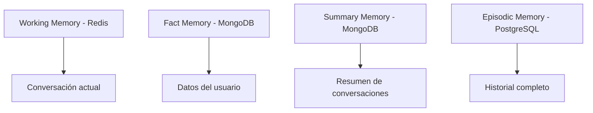

# Elephant

Elephant is a conversational backend with layered memory. It is built with FastAPI,
SQLModel, PostgreSQL with pgvector, MongoDB, Redis, and Docker.

## Features

- Keep active sessions in Redis with a renewable TTL
- Store factual and summary memory in MongoDB
- Store embedded conversation turns in PostgreSQL with pgvector
- Consolidate closed sessions in the background

## Getting Started

### Requirements

- Docker and Docker Compose
- [uv](https://docs.astral.sh/uv/) — `brew install uv`
- Make

### Running the Project

```bash
cp .env.example .env    # only outside a Superset workspace; setup does it for you
make up
```

`make up` waits for Mongo, Redis and Postgres to report healthy before starting
`core-api`, which creates its own PostgreSQL schema on startup. There is no
separate initialization step.

Schema changes may require a local reset. `docker compose down -v` deletes the
`pg_data` and `mongo_data` volumes. Both volumes are intentionally disposable;
PostgreSQL turn history and MongoDB memory are discarded:

```bash
docker compose down -v --remove-orphans
make up
```

Services listen on the ports in `.env`. Inside a Superset workspace those come
from a reserved block, so several workspaces run side by side:

| Service | Variable | Default |
|---|---|---|
| core-api | `CORE_API_PORT` | 8000 |
| agent | `AGENT_PORT` | 8001 |
| memory | `MEMORY_PORT` | 8002 |
| postgres | `POSTGRES_PORT` | 5432 |
| mongo | `MONGO_PORT` | 27017 |
| redis | `REDIS_PORT` | 6379 |

To start a single service: `docker compose up -d --wait memory`.

> **Orphaned containers from before the compose project name was pinned:** if you
> ran this stack before `docker-compose.yml` started setting `name: elephant-${PORT_BASE:-8000}`,
> your old containers and volumes live under the previous implicit project name (the
> worktree's directory name), and `docker compose down -v` here will not remove them.
> No data is lost, but they linger. List and remove them with:
> `docker compose -p <old-name> down -v`.

### Tests

```bash
make test        # every service
make lint
make typecheck
```

Other available urls:

- `POST /sessions` creates a conversation for a subject.
- `GET /sessions/{session_id}` reports consolidation status and turn count.
- `POST /sessions/{session_id}/close` schedules consolidation and returns `202`.

- `GET /author` Retrieve author data


### Useful Makefile Commands

- `make up` - Starts all services in the background
- `make down` - Stops and removes all containers
- `make build` - Builds the service images
- `make rebuild-app` - Rebuilds the `core-api` image and restarts all services
- `make logs` - Follows the logs of all Docker containers
- `make ps` - Lists running containers
- `make shell` - Opens a shell in the `core-api` container
- `make psql` - Opens a `psql` session against the `postgres` container
- `make test` - Runs the test suite for every service
- `make lint` - Checks formatting with black and isort
- `make format` - Applies black and isort formatting
- `make typecheck` - Runs mypy for every service
- `make coverage` - Runs `core-api` tests with coverage

## Conversation Memory Use Cases

Elephant incorporates a multi-layered memory system inspired by human cognition, enabling rich and context-aware interactions. These are the main use cases supported by the `CognitiveOrchestrator`:

### Initial Conversation Bootstrapping
When a user starts a new conversation, the system creates an empty working-memory
session. While handling messages, it reads:
- A summarized memory (semantic context)
- A structured factual memory (preferences, identity, traits)

These components are injected as non-conversational context without storing them in
working memory.

### Ongoing Interaction
As the user and assistant exchange messages, each turn is stored in working memory (Redis). This cache:
- Tracks recent turns for continuity
- Is kept separate from factual memory and summary memory to avoid mixing signal with noise

### Contextual Expansion on Demand
In naive mode, the orchestrator retrieves the subject's complete episodic history from
PostgreSQL and adds it to the prompt. Similarity-based recall is introduced separately.

### Conversation Closure and Consolidation
When the session is explicitly closed, the API marks it as consolidating and schedules
background work. The worker:
- Embeds complete user/assistant turns and appends them to PostgreSQL
- Summarizes the recent session and merges it with the prior summary
- Extracts any newly revealed facts and updates the factual memory accordingly
- Clears the turns, marks the session as consolidated, and leaves its TTL running

This layered approach ensures long-term retention, efficient recall, and low-token consumption during active sessions.


## 🧠 Agent Memory


```mermaid
graph TD
  REDIS[Working Memory - Redis] --> CURRENT[Conversación actual]
  MONGO_FACT[Fact Memory - MongoDB] --> USER_DATA[Datos del usuario]
  MONGO_SUM[Summary Memory - MongoDB] --> SUMMARY[Resumen de conversaciones]
  POSTGRES_EPISODIC[Episodic Memory - PostgreSQL] --> HISTORY[Historial completo]
```
