# KABOT

Kabot is a data ingestion and indexing system that allows uploading CSV files, parsing them, and storing the data both in PostgreSQL and OpenSearch. It is designed with a modular and asynchronous architecture using FastAPI, SQLModel, and Docker.

## Features

- Upload and process CSV files via HTTP endpoint
- Store records in PostgreSQL and OpenSearch simultaneously
- Chunked and asynchronous processing for performance
- Uses OpenSearch to allow indexing and searching
- Uses PostgreSQL for relational data storage

## Getting Started

### Requirements

- Docker and Docker Compose
- Make

### Running the Project

To start the application:

```bash
make start
```

This will build and run all required containers (API, PostgreSQL, OpenSearch, etc.).

### Initial Setup

After running the containers, you **must** initialize the databases by running:

```bash
make setup
```

This command will:

- Create the required tables in PostgreSQL
- Create the index in OpenSearch

Skipping this step will cause the application to fail when trying to interact with the databases.

Let the system finish all it tasks, give one or two minutes and then you can send a Postman Request to `/upload` this will save data in postgres and create embeddings with data in opensearch.


Other available urls:

- `GET /search` Perform a manual search into OpenSearch.
  Example: `http://localhost:8000/search?query=tracción 4wd`

- `POST /debug/migrate-memory` Enforces system to migrate WorkingMemory to Long-Term  emory. Example: `http://localhost:8000/debug/migrate-memory?user_id=5215578771322`

- `GET /author` Retrieve author data

- `POST /webhook/whatsapp` You can manually simulate the receive of a message, this is a `x-www-form-urlencoded` so it will require fields:
- `From` with format `whatsapp:+5215578771322`
- `Body` with the message
- `Sandbox` By sending `true` you will only see response in Postman but not in whatsapp.


### Useful Makefile Commands

- `make rebuild-app` - Rebuilds the Docker containers and runs the application
- `make setup` - Initializes database schemas (PostgreSQL + OpenSearch)
- `make enter-app` - Enters the running app container
- `make activate-venv` - Activates the virtual environment inside the container
- `make rebuild-python` - Rebuilds only the Python-related containers without resetting databases
- `make logs` - Follows the logs of all Docker containers

### API Endpoint

- `POST /upload` - Upload a CSV file to ingest data into the system

## Notes

- The system uses chunked ingestion (100 records per chunk) to avoid memory issues
- Boolean fields are interpreted from strings like "Sí", "Yes", "True", etc.
- Duplicate records are avoided in OpenSearch by using `stock_id` as the document ID

---

Built with 💻 and lots of coffee ☕️ by Leonardo and ChatGPT.
(Si lo leí, si le di permiso de que lo pusiera ahí, sería irónico crear un sistema para trabajar con LLMs sin usar un LLM ¿no creen? atentamente y con mucho respeto, Leo)


## Conversation Memory Use Cases

Kabot incorporates a multi-layered memory system inspired by human cognition, enabling rich and context-aware interactions. These are the main use cases supported by the `CognitiveOrchestrator`:

### Initial Conversation Bootstrapping
When a user starts a new conversation, the system retrieves and loads:
- A summarized memory (semantic context)
- A structured factual memory (preferences, identity, traits)

These components are injected as non-conversational context to prime the LLM for coherent and personalized responses.

### Ongoing Interaction
As the user and assistant exchange messages, each turn is stored in working memory (Redis). This cache:
- Tracks recent turns for continuity
- Is kept separate from factual memory and summary memory to avoid mixing signal with noise

### Contextual Expansion on Demand
If the LLM cannot resolve a user's query due to insufficient context, the orchestrator:
- Retrieves the full episodic history from long-term memory (MongoDB)
- Augments the current prompt with this deep history for accurate reasoning

### Conversation Closure and Consolidation
When the conversation ends—either due to inactivity or an explicit farewell—the orchestrator:
- Persists the working memory into the episodic memory store (append-only)
- Summarizes the recent session and merges it with the prior summary
- Extracts any newly revealed facts and updates the factual memory accordingly

This layered approach ensures long-term retention, efficient recall, and low-token consumption during active sessions.


## 📚 Used prompts

```mermaid
graph TD
  P1[INTENTION_PROMPT] --> Detecta_intención
  P2[FILTER_EXTRACTION_PROMPT] --> Extrae_filtros_JSON
  P3[VEHICLE_SUMMARIZATION_PROMPT] --> Resume_autos
  P4[FINANCE_PROMPT] --> Estima_mensualidades
  P5[KAVAK_INFO_PROMPT] --> Responde_dudas_generales
  P6[EXIT_PROMPT] --> Cierre_conversación
```



## 🧠 Agent Memory

```mermaid
graph TD
  REDIS[Working Memory - Redis] --> CURRENT[Conversación actual]
  MONGO_FACT[Fact Memory - MongoDB] --> USER_DATA[Datos del usuario]
  MONGO_SUM[Summary Memory - MongoDB] --> SUMMARY[Resumen de conversaciones]
  MONGO_EPISODIC[Episodic Memory - MongoDB] --> HISTORY[Historial completo]
```

